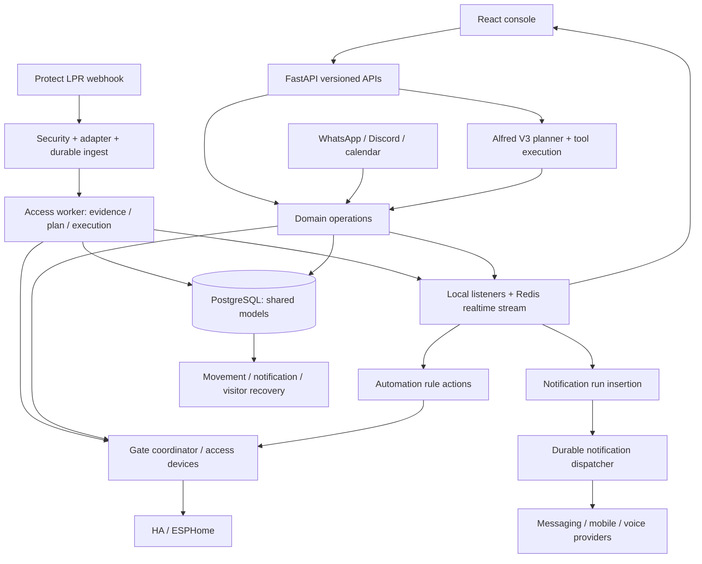

# IACS architecture audit — 12 September 2026

This is a completed, source-led assessment of the **current working tree**, including its uncommitted implementation. It is not an assessment of HEAD alone or a claim about the live deployment. Only these audit/planning documents were changed. Read [target architecture](TARGET_ARCHITECTURE.md) and [executable recovery plan](REMEDIATION_PLAN.md) alongside this report. [docs/architecture.md](../architecture.md) remains the current ownership guide; this dated review does not redefine the implementation by assertion.

## Assessment

IACS has **systemic coupling at authority, state-transition and side-effect boundaries, alongside several well-designed modules**. The frontend is principally locally tangled. A full rewrite is not justified by the evidence. The important defects are not explained by file length: an authorization decision can be lost between access and automation; pending Alfred approvals lack an atomic execution identity; historical writers do not all respect the new live movement contract; and command acceptance, target scope and physical verification disagree across layers.

Recent recovery milestones made real improvements. Preserve the pure access plan/FSM, durable ingest and suppression, shared schedule/visitor/rule operations, notification recovery store/dispatcher, explicit Alfred V3 catalog/input/context boundaries, and frontend schedule/workflow/refresh owners. Use those seams for **staged replacement of the small mechanisms that cannot currently express safe execution**, with structural refactoring elsewhere. Do not repeat their already-completed extraction work.

The strongest executed finding is order-dependent multi-gate aggregation: an inert probe returned OPEN for [OPEN, UNKNOWN], UNKNOWN for the same accepted outcomes in reverse order, and FAULT/accepted=false for [OPEN, rejected], although the first target had accepted. All provider results were synthetic; no device service, controller or database was called. Other concurrency/crash scenarios below are supported by source tracing but were not reproduced with PostgreSQL in this audit.

## Baseline and method

- Repository root: `/Users/jas/Documents/Intelligent Access System`.
- Branch: `main`; HEAD: `69f9d8cfc1f77417a57105223f4e0772ae62de5d`.
- Initial working tree: **143 modified/deleted/untracked file entries**, expanded to individual untracked files. Full initial state is retained at the end of this report.
- A source snapshot and SHA-256 manifest covered **485 safe first-party/configuration/document/fixture files**. Excluded `.env*`, runtime `data/`/`logs/`, credentials, symlinks, dependency directories, build products and caches. Source reads include tracked modifications and untracked additions; deleted files remain absent.
- Temporary evidence: `/private/tmp/iacs-architecture-audit/` contains `baseline.json`, `source/`, measurements, exact commands/scripts, JUnit/logs and inert-probe output. The conclusions, measurements and check results needed to use this plan are recorded here; temporary evidence may not survive host housekeeping.
- Breadth first: inventoried every selected file; statically parsed all 213 backend application Python modules, mapped routers/models/lifecycle, measured imports and history. Three read-only specialist reviews then traced access/movement, frontend, and effects/Alfred/messaging; principal review reconciled them with auth, persistence, configuration, CI and operations. Specialist notes were evidence inputs, not independent deliverables substituted for whole-system synthesis.
- Read AGENTS and all three focused agent guides, current ownership guide, README/backend README, phase 1/2/5 documents, prior change-bloat audit, phase1 validation instructions and milestone 1–6 handoffs. Prior memory served only as a locator/safety-context aid. Old test totals and claimed releases were not treated as current validation.
- No external sources were needed to establish repository behavior. No production configuration, personal records, telemetry payloads or secrets were read. No hardware, messages, live API smoke checks, production-connected workers, dependency installations, migrations, upgrades, deployment, commits or pushes were performed.

### Measurements and limits

Physical lines include comments/blanks. Counts are clues, not complexity scores or reduction targets.

| Selected category | Files | Lines |
|---|---:|---:|
| Backend application Python, including simulation | 213 | 80,292 |
| Backend Python tests | 71 | 27,452 |
| Frontend application TS/TSX inside `src/`, excluding tests/fixtures | 74 | 26,976 |
| Frontend test/setup TS/TSX | 14 | 780 |
| Frontend synthetic fixture file | 1 | 203 |
| First-party styles | 11 | 18,346 |
| Alembic files, including env/template | 10 | 684 |
| Operational/validation scripts | 11 | 3,713 |
| Documentation before this review | 21 | 3,776 |
| Lockfiles, separately excluded from application counts | 2 | 5,665 |
| Other source/config/assets/JSON fixtures | 37 | 7,355 text lines |

Largest current application files: `services/chat.py` 2,806; `services/dependency_updates.py` 2,612; `services/automations.py` 2,317; `views/DirectoryViews.tsx` 2,306; `ai/tool_groups/access_diagnostics_handlers.py` 2,163; `services/notifications.py` 2,046; `views/ChatWidgetView.tsx` 2,024. Paths beginning `services/` and `ai/` here are under `backend/app/`; frontend paths under `frontend/src/`. Large function spans include `ChatService._handle_message_v3` (372 lines), `AccessExecution.execute` (314), and `_create_backfill_event` (229). Catalog `build_tools` spans can exceed these but largely declare data; they are not evidence of excessive orchestration.

Python AST scan resolved **1,135 intra-application import edges across 213 modules**. Counting deferred imports and type-only imports, one strongly connected component contains **52 modules**. Counting only direct module-body import statements, one component contains **five WhatsApp modules**. The latter was manually verified as real runtime backreferences. Deferred/type-only edges do not prove an import-time crash, and this graph does not model calls, SQL, JSON keys or runtime registration. High fan-in: `app.models` 91, `app.db.session` 76, `services.telemetry` 58, `services.settings` 54, `services.event_bus` 39. High orchestration fan-out is expected in router/lifespan; it is a problem only when ownership runs backwards.

A separate conservative literal frontend import scan found **no multi-file cycles** (includes root `vite-env.d.ts`, hence its 75-file count differs from the `src/` table). Existing CI cycle checks only cover schedule/workflow feature nodes. This was not a compiler-complete dependency graph.

Available Git history contains 96 commits in the requested last-100 window. Most frequently touched paths: old `frontend/src/main.tsx` 45 commits; `access_events.py` 39; `models/core.py` 34; `db/bootstrap.py` 30; `ai/tools.py` 29; `chat.py` 27. **These are historical hotspots, not current size claims**: main.tsx and tools.py have already changed ownership. Large uncommitted milestone changes are absent from commit-frequency statistics. Co-change/change-cost figures are not causal performance measurements.

Static surface inventory: **52 mapped tables**, **206 route declarations in 30 `api/v1` files**, plus three simulation routes and root health aliases. Route counts include WebSocket declarations and are not a generated OpenAPI compatibility proof. `workers/`, `scripts/` and `schemas/` inside the app are effectively placeholders; actual workers live in services and lifespan.

## Coverage ledger

“Deep” means critical symbols/branches and callers were traced, not every line or product input exhaustively reviewed. All runtime checks were isolated; none establish live incidence.

| Subsystem / relevant current paths | Inspection | Depth | Executed evidence / remaining gap |
|---|---|---|---|
| Bootstrap/API wiring: `main.py`, `api/router.py`, `db/bootstrap.py`, Compose | Full wiring, middleware, start/stop ordering | Deep static | Syntax/Compose parsing; no lifespan execution or startup-failure injection |
| Recognition: `modules/lpr/*`, `api/v1/webhooks.py`, `lpr_webhook_security.py`, `lpr_ingest.py`, `access_events.py` | Security, normalized read, durable queue, suppression and restart branches | Deep core; vendor shapes sampled | Existing suites in backend run; no live camera/replay/load test |
| Access stages: `services/access/*` | Evidence, plan, transactions, hardware, enrichment | Deep | Existing tests; no new PostgreSQL transaction/cancellation experiments |
| Movement: `movement_fsm.py`, `movement_ledger.py`, `movement_reconciliation.py`, `movement/*`, `restart_backfill.py` | Direction, leases, saga/presence, reconstruction | Deep; session helpers sampled | Existing tests; concurrency, delayed maintenance replay and equal-time ordering remain unproved |
| Gate/garage: `gate_commands.py`, `access_devices.py`, `modules/gate/*`, `modules/access_devices/*`, `gate_malfunctions.py` | Intent/failover/aggregation/reconciliation/recovery actuation | Deep command paths; malfunction presentation sampled | Inert aggregation probe + existing tests; no topology/controller semantics verified |
| Directory/groups/vehicles: `api/v1/directory.py`, models, photo/DVLA helpers | CRUD/assignments and downstream use | Sampling plus deep assignment seam | Existing directory/photo/DVLA tests; full concurrent CRUD semantics not proven |
| Schedules/overrides: `schedule_operations.py`, `schedule_assignments.py`, `schedule_overrides.py`, `schedules.py` | Policy precedence, validation, actor/audit, transaction participation | Deep | Existing unit/contracts; isolated persistence/DST/races not run |
| Visitors/calendar: `visitor_passes.py`, `icloud_calendar.py`, API and messaging callers | Claim/window/arrival/cancel/lifecycle/source sync | Deep policy; vendor auth sampled | Existing tests; no CalDAV/network or live pass data |
| Notifications/actionable messages: `notification_{rules,runs,dispatch}.py`, `notifications.py`, `actionable_notifications.py`, provider modules | Plan, lease, checkpoint, partial/unknown, action TTL | Deep recovery; provider rendering sampled | Existing unit/contracts; dedicated PostgreSQL recovery scripts not run |
| Automations: `automations.py`, `automation_integration_actions.py`, `workflows/*` | Catalog/CRUD, webhook, cron claim, provenance and actions | Deep | Existing dry-run/webhook tests; no real claim/crash/DST matrix |
| Alfred V3: `services/alfred/*`, `chat.py`, `ai/*`, `api/v1/ai.py` | Planner, tool catalog/execution, approvals, context, memory and training | Deep execution; individual read tools/provider protocols sampled | Existing catalog/context/provider tests; no real provider quality or concurrent approval DB test |
| WhatsApp/Discord: facade/messaging modules/bridge/bot | Sender scoping, signatures/dedupe, visitor sandbox, approvals, delivery lifecycle | Deep core; presentation sampled | Existing tests, three DB-dependent WhatsApp tests fail in inert runner; no provider calls |
| Auth/users/confirmations: `auth.py`, `action_confirmations.py`, dependencies, users/auth/AI routes | Token validation, current roles, row locking, mutation entry points | Deep critical boundaries; account UI sampled | Existing tests; no pen test or complete session privacy review |
| Config/secrets/maintenance: `core/config.py`, settings/auth-secret/crypto services, settings/maintenance API | Typed bootstrap/dynamic settings, cache, encryption and audit timing | Deep selected paths; full settings catalogue sampled | Existing tests; no root rotation, credential reads or runtime config validation |
| Realtime/telemetry/audit: `event_bus.py`, `domain_events.py`, `telemetry.py`, API | Fanout/local listeners, task delivery, transaction audit vs trace | Deep transport/audit; purge/export endpoints sampled | Existing tests; no Redis outage/pressure or live purge |
| Media/reports/investigations: snapshots/recovery, profile photos, attachments, `reports.py`, `investigations/*`, API | Storage/security owners; report preview/export contract; read-model composition | Deep report mismatch; other query/rendering paths sampled | Existing tests; no PDF visual QA, full query-plan/load or image correctness validation |
| Enrichment/analytics: visual detections, DVLA, expected presence, leaderboard, LPR timing/zones | Entry points, model writes, optional-stage ownership | Sampling | Existing tests; no image/ML accuracy or runtime performance claims |
| HA/Protect/ESPHome: clients/services, person booleans, updates | Adapters, side effects, timeouts, polling/reconnect and operations | Deep cover transport; remaining protocols/updates sampled | Existing clients/update tests; no vendor interoperability/update/backup execution |
| Operational updater: dependency service/API, scripts, Dockerfiles | Job lifecycle, manifests, promotion/restore/checks | Deep critical release artifacts; LLM diagnosis sampled | Unit tests/static trace; no dependency resolution, rebuild, restore or deployment |
| Frontend shell/auth/realtime: `app/*`, `api/client.ts`, route/error boundary | Auth, lazy routes, resource lifetime, transport dependencies | Deep | 63 tests/cached build; no browser visual/auth/session/socket integration run |
| Frontend domain UI: directory/passes/schedules/workflows/integrations/dashboard | Mutations, confirmations, data ownership | Deep selected flows; large JSX/styles sampled | Existing tests, no real browser or live mutations |
| Frontend reports/Alfred/investigations/events/movements/charts/logs | Query/preview, confirmations, request cancellation, UI scope | Deep cited defects; presentation sampled | No >250-event preview parity, deferred-fetch or full V3 browser probes |
| CI/migrations/dependencies/docs | All manifests/workflows/migration files and relevant instructions | Deep configuration/static; historical evidence sampled | Targeted + broad lint, syntax, snapshot selection, cached build; no fresh migration or locked frontend installation |

## Current architecture: static and runtime views



This is a modular monolith deployed as frontend, backend, updater, PostgreSQL and Redis Compose services. There is no discovered fleet of separate business workers. Uvicorn starts one process in the checked Compose command. Several services nevertheless have cross-process mechanisms, while others have process-local queues/caches. Do not assume safe scale-out or introduce it as a remedy.

The static service/module convention is useful but incomplete. `modules/gate/access_devices.py` imports the application device service; notification rule normalization imports the delivery service; WhatsApp implementation imports back into its facade. A flat shared ORM registry is convenient, but makes writing any table cheap from any caller. Transaction ownership, not table file location, is the key missing restriction.

### State, temporal coupling and hidden dependencies

| State | Current authoritative record / writer(s) | Other copies / coupling |
|---|---|---|
| Identity/active status/assignments | Person/Vehicle/Group/VehiclePersonAssignment; directory operations/routes | Alfred query/repair handlers, current plate mappings used in browser report attribution |
| Permissions | Schedule + overrides + assignments; `schedules.py` evaluates | Access evaluates captured time; device service uses execution time; settings include defaults |
| Visitor validity/arrival | VisitorPass + `VisitorPassService` | Lifecycle status, reservation/consumption, source metadata conversations and historical evaluation overlap |
| Recognition receipt | LprIngestEvent; `LprIngestRepository` | Local queue, in-flight IDs/debounce/session caches; stale processing threshold 300s |
| Movement/session | MovementSagaRecord/MovementSessionRecord; ledger/FSM/session helpers | JSON `movement_saga`, `gate_observation`, `historical_repair`, skip-action flags cross independent paths |
| Presence | Presence; live/reconciliation helper, restart latest-grant selector, Alfred direct writer | HA booleans are a projection; FSM reads presence as evidence for subsequent decisions |
| Physical operations | GateCommandRecord, observations, malfunction records; coordinator/device/provider layers | Per-device state cache, aggregate first-gate state, provider receipt, current status and timeline are different evidence |
| Notification delivery | NotificationRun plan/action states/lease/token; dispatcher/store | Gate malfunction outbox; transient producer events before run insertion; endpoint fanout inside one action |
| Automation delivery | AutomationRule/AutomationRun | Claimed occurrence returned as Python list; actions precede final commit; no per-action recovery journal |
| Approval | Generic ActionConfirmation row vs Alfred `ChatSession.context.pending_agent_action` | Separate protocols with different atomicity/current-actor behavior |
| Messaging intake | ProcessedMessagingMessage; visitor JSON buffer/context | Claim-before-processing plus local wakeup; dedupe is not completion |
| Configuration | SystemSetting; encrypted values tied to auth root | Process-local 2s RuntimeConfig cache, bootstrap defaults, provider caches and JSON device bindings |
| Audit/observability | AuditLog for required changes; TelemetryTrace/Span separately | `write_audit_log(session)` can join mutation; `emit_audit_log` schedules a later independent transaction |
| Release/update state | Source manifests, uv/npm locks, images/source mounts, Alembic revision; update job/backup tables | These artifacts do not currently form one verified release/rollback unit |

Realtime stream `iacs:realtime:events:v1` is bounded at 10,000 records; socket queues at 250. Event names and audit-action prefixes are strings consumed by automation, notifications, caches and frontend invalidation. EventBus starts readers at the latest stream position and mutation listeners are local by default (`event_bus.py:51-59,205-213,274-344`). This avoids duplicate fanout effects but does **not** guarantee durable work after a committed origin transaction. Settings TTL and device caches are bounded reliability choices, not intrinsically defects; captured configuration version/freshness is missing at some decision boundaries.

## Feature/contract inventory

All paths below are current. Backend paths abbreviate `backend/app/`. Test names abbreviate `backend/tests/` unless `scripts/phase1/` is specified.

| Feature | Entry → decision/operation owner | State → effects | Existing protection |
|---|---|---|---|
| Recognition/access | `api/v1/webhooks.py` → LPR security/adapter → `AccessEventService` → access stages | ingest/event/saga/pass/session/presence → audited gate/garage → optional enrichment/UI/notification run | access, webhooks, LPR, FSM, contract and phase1 access tests |
| Manual gate/garage | `integrations.py` + Dashboard/Alfred → confirmation → coordinator/device service | command/audit/observation → HA/ESPHome | confirmations/gate/device tests; missing whole dashboard target test |
| Gate malfunction recovery | observed state → `GateMalfunctionService._execute_attempt_for_id` | durable malfunction attempt → coordinator with stable intent; notification outbox | malfunction/gate tests; keep as intended autonomous recovery |
| People/groups/vehicles | directory API → identity CRUD, photo/DVLA and `set_schedule_assignment` | identity/assignment/audit → UI and optional discovery/test actions | directory_people/schedule/feature tests |
| Schedules/defaults/overrides | API/Alfred → operations/assignments/overrides; evaluation in schedules | schedule/override/audit; next access/cover decisions | schedule unit and phase1 parity/rollback suites |
| Visitors | API, calendar, concierge → VisitorPassService | pass state/audit → claims, lifecycle notifications, messages | visitor/calendar/sandbox/phase1 access tests |
| Movement/history/presence | worker/reconciler/restart/Alfred repair | saga/session/event/presence → next FSM decision, HA sync/UI | movement/restart/presence contracts; historical-writer gap remains |
| Alerts/events/snapshots | event outcomes + anomaly generation → events API/SnapshotManager | anomalies/media paths/event metadata → UI and signed notification media | alerts/snapshot/recovery/media tests |
| Notification rule/delivery | API/Alfred/producer → rule owner/NotificationService/store/dispatcher | rules/runs/action contexts → Apprise/HA mobile/voice/Discord/WhatsApp/in-app | workflow/actionable/recovery tests |
| Actionable notifications | TTL-bound context/signature and response handlers | one-use action context → visitor/device operation | actionable tests; delivery acceptance does not prove human receipt |
| Automations | scheduler/webhook/realtime → AutomationService | rules/runs/nonces → domain mutations/hardware/calendar/messages | dry-run/webhook/claim tests; no durable action journal |
| Alfred V3 | HTTP/SSE/WS/messaging → planner/permissions/tools/executor/chat | sessions/messages/approvals/memory/lessons/feedback → domain operations | 84-definition catalogue preservation, execution/provider/context tests |
| WhatsApp | signed webhook → dedupe/sender router → Admin bridge or visitor sandbox | processed ID/pass metadata → restricted pass changes/replies | privacy/abuse/privileged-plate/timeframe tests |
| Discord | bot/channel rules → linked active IACS user → shared bridge | identity/session → V3 replies/confirmed operations | Discord/bridge tests |
| Calendar | iCloud APIs/automation → client/parser/sync → visitor service | account/sync/pass → post-commit pass events | calendar reconciliation tests; blocking vendor calls use to_thread |
| Auth/users | setup/login/cookie/bearer/WS → auth and current/admin dependencies | users/session version/revocations/confirmations → access to routes | auth/user/confirmation/safety tests |
| Settings/secrets/maintenance | settings/auth rotation/maintenance routes → respective services | encrypted SystemSetting/auth root/maintenance/audit → integration refresh and queue policy | settings/auth-secret/maintenance safety tests |
| Reports | reports API → report snapshot builder/duration calculations/PDF export | ReportExport + artifact → download; browser also computes preview | backend report tests; preview parity absent |
| Investigations/search | telemetry/search APIs → investigations repository/interpreter/presenter | cross-domain read model → timeline/answers; some question inputs use providers | investigations/search/redaction tests |
| Analytics/enrichment | leaderboard/expected presence/DVLA/visual detection/LPR zone and timing services | cached/materialized analytics/media metadata → status/UI/optional notifications | targeted tests; no accuracy/performance validation |
| Protect operations | integration API → service/client/update owner | integration state/package backup → vendor read/update/restore after confirmation | client/update tests; external feature preserved |
| Dependency operations | API/UI → DependencyUpdateService | enrolled packages/analysis/jobs/archives/manifests → proposed update/promotion/restore | dependency unit tests; release artifacts incomplete |
| Deployment/operations | Dockerfiles/Compose/lifespan/scripts/CI | bind mounts, images, schema, workers and caches | isolated harness exists; run/reproducibility limits below |

### End-to-end traces and edge cases

**A. Recognition to outcome.** `webhooks.py:199-286` verifies configured token/source allowlist before normalized persistence. Forwarded IP is used only behind configured trusted proxies (`lpr_webhook_security.py:16-105`). `enqueue_plate_read:216-235` persists unique identity; duplicate failed receipts can be made pending by the repository. Worker ordering (`access_events.py:668-720`) includes OCR identity, malfunction/zone handling, exact/session suppression, external admission, visitor departure and debounce. Suppressed reads get durable saga/session evidence (`1210-1250`), not silent drops.

`AccessEvidenceResolver.resolve:75-186` loads identity/active owner, schedule and history or claims a visitor. `schedules.evaluate_vehicle_schedule:77-123` owns override/vehicle/person/default precedence. `access_is_allowed:17-26` and the FSM distinguish permission from direction. Direction uses denied/visitor/malfunction/camera/gate/presence precedence (`movement_fsm.py:111-252`); uncertain camera evidence retaining a closed-gate arrival is an existing contract, not an audit-invented fail policy. Allowed ENTRY + CLOSED + no suppression requests hardware. An unknown physical gate state can therefore yield an authorized record without a command. Externally admitted unknown observations may be recorded GRANTED with hardware explicitly suppressed; GRANTED is not proof of IACS actuation or passage.

`AccessExecution.execute:115-160,193-308` locks/reuses a unique saga and commits event/saga/pass/ingest before hardware. `310-378` calls the hardware owners, then locks fresh state and commits safe presence/session/outcome; a completed reconciliation is retained. Ordinary committed LPR replay exits before another hardware attempt. `AccessEnrichment` then independently adds optional vehicle/media/visual data and publishes/enqueues; it never merges an old whole ORM entity over newer state. Its failure does not undo core access, but interruption can lose optional work and producer delivery before run insertion.

**B. Manual action.** `integrations.py:619-692` requires Admin, checks maintenance, consumes a payload-bound confirmation, creates an untargeted GateCommandIntent, calls the coordinator and returns command ID/accepted/mechanically_confirmed/reconciliation. Generic confirmation lookup has a row lock (`action_confirmations.py:168-176`) and user/action/payload/expiry checks. Dashboard individual gate labels are not sent as targets. Controller opens all enabled `open_for_access` gates and aggregates their outcomes. Accepted request, current position and physically completed passage must remain distinct. The garage route uses device identity and AccessDeviceService but lacks the same durable per-command lease/journal as gate opens.

**C. Visitor lifecycle.** API/calendar/concierge mutations use VisitorPassService and caller transactions. Claim at `visitor_passes.py:492-534` locks active candidates with SKIP LOCKED. One-time matching is deliberately not restricted to its stored plate; duration matching is. Explicit start/end windows are half-open; expected-time one-time windows include both symmetric boundaries (`694-698,758-780`). Lifecycle refresh runs every 30s. One-time claim sets USED/arrival before command; cancellation/expiry alter status used by historical matching. These are observed contracts requiring a product decision, not permission to silently change visitor rules.

**D. Presence/delayed/conflicting observations.** The live worker is serial locally, but reconciliation, restart and Alfred repair are independent writers. Saga idempotency protects a committed identity; it is not a global presence lock. `commit_presence_for_event` has a timestamp guard but no atomic compare/write; latest-person reconstruction selects GRANTED without requiring eligible command outcome. Alfred repair writes presence directly. Duplicate and OCR suppression are well represented; equal-timestamp ties, concurrent stale writes, failed-grant history, and delayed receipt after lifecycle expiry remain gaps. Maintenance clears local pending windows, while durable PROCESSING rows can later become stale/recoverable: test what should happen after maintenance ends rather than assuming “cleared” means retired permanently.

**E. Delivery and retries.** New NotificationRun recovery version 1 persists rendered plans/selection criteria and DB-time claims. Dispatcher commits `attempting` before I/O; acceptance/unknown afterward. Unknown attempted actions are not automatically retried; pending actions can recover, with age limits. Partial provider fanout remains accepted with failure metadata. Historical unfinished rows remain review-only; no sender endpoint exactly-once guarantee is claimed. By contrast, automation flushes a run before side effects but commits completion afterward, scheduled claims are handed off in memory, and WhatsApp dedupe can precede actual handling. Required producer delivery and provider acceptance are separate commitments.

**F. Alfred.** `ChatService.handle_message` always selects V3 (`chat.py:145`); registry explicitly builds nine groups. Planner-scoped tools validate inputs; current contract/context modules are stdlib-only. Mutation preview stores `pending_agent_action`; confirmation reads/clears that JSON and calls a handler. This differs materially from atomic generic ActionConfirmation consumption. Current actor revalidation varies by handler. Stable approval identity must survive into the actual domain command. No pre-V3 guided runtime was found on the registered chat entry. Local diagnostic/embedding/restricted visitor fallbacks have current purposes and are not blanket deletion candidates.

**G. Startup/restart/reconnection.** `main.lifespan:72-110` initializes migrations/seeds, starts event bus, dependency scanner, notification dispatcher, automations, Discord, visitors, device/access/movement/HA/malfunction/Protect services, then heartbeat/backfill/reconciliation/snapshot tasks. Cleanup is installed only at line 112 and sequentially awaits stops. Notification recovery has explicit polling; movement/backfill has explicit inert reconstruction; automation/message buffers/feedback jobs have different incomplete recovery semantics. Gate malfunction recovery is intentionally live actuation and must not be confused with hardware-inert historical repair. EventBus reconnect and frontend resnapshot compensate for display gaps, not lost business work. UI navigation currently recreates the session socket.

## Findings

Severity describes consequence; confidence describes evidence. High static confidence is not evidence of a production incident. Findings are ordered primarily by operational risk, then recurring change/release cost. IDs are stable across all three reports.

| ID | Root cause | Severity / confidence | Treatment |
|---|---|---|---|
| IACS-01 | Missing end-to-end per-target delivery-certainty/result contract | High / high; some retry scenarios need DB proof | Replace bounded outcome/attempt protocol; retain adapters/coordinator |
| IACS-02 | Automation loses originating authority | High / high static; configuration exposure unknown | Refactor explicit admission owner |
| IACS-03 | Alfred approval stored as ordinary mutable conversation memory | High / high static | Replace approval persistence/execution boundary |
| IACS-04 | Historical/live movement and presence have different writers/eligibility | High / high static | Consolidate state transition owner |
| IACS-05 | Visitor authorization, reservation and arrival share lifecycle status | High availability / high behavior, intent unresolved | Refactor after policy decision |
| IACS-06 | Durable work acceptance/journaling is inconsistent | High automation, medium messaging / high static | Staged journal/inbox/outbox replacement |
| IACS-07 | Canonical mutation/audit ownership is incomplete | Medium / high static | Consolidate narrow operations/transactions |
| IACS-08 | Report preview and critical wire contracts have parallel truth | Medium / high static | Replace preview query; enforce selected wire contracts |
| IACS-09 | Frontend request and transport lifetimes have uneven ownership | Medium / high static | Refactor specific lifetime owners |
| IACS-10 | Historical migration depends on current application metadata | High release risk / high static | Freeze schema contract, preserve revision/data history |
| IACS-11 | Update/rollback artifact omits locked release state | High release risk / high static | Replace bounded manifest promotion/backup unit |
| IACS-12 | Validation is not one reproducible, safely isolated gate | Medium-high / high measured | Repair runner/CI proof boundaries, baseline ratchet |
| IACS-13 | Service lifecycle cleanup depends on successful startup/preceding stops | Medium / high static | Refactor composition and task ownership |
| IACS-14 | Dependency directions still conceal shared ownership | Medium recurring cost / high static | Consolidate domain policy; remove facade backreferences |

### IACS-01 — Carry target scope and uncertainty across every actuation layer

**Evidence:** `modules/access_devices/home_assistant.py:119-144` maps service-call exceptions to ProviderUnavailable but correctly keeps a successful send with later state-read failure as unknown. `_command_with_failover` (`services/access_devices.py:525-723`, especially 547-571/710-723) advances after any command exception. Accepted-unverified opens stop (`679-708`), whereas closes explicitly retry/fail over (`653-678`; deliberate tests at `test_access_devices.py:380-524`). ESPHome ordinary state-sample failures already become UNKNOWN (`esphome.py:476-503`); do not attribute that safe path to the defect.

Multi-target aggregation uses the first state (`modules/gate/access_devices.py:10-43`), coordinator turns OPEN/OPENING into mechanical confirmation (`gate_commands.py:103-116`), and saga reconciliation may use current aggregate state without command attribution (`movement_reconciliation.py:274-283`). Standalone reconciliation has stronger command-window matching. `movement_ledger.claim_gate_command:197-233` permits an expired LEASED row to be reclaimed; a repeated independent intent could race reconciliation. Normal committed LPR replay is guarded, so this is not a claim that every restart resends.

Dashboard presents individual gates (`DashboardView.tsx:273-279,589-600`) but sends no target (`153-168`); it discards the receipt (`165-188`). A displayed manual-only gate can therefore invoke the separate open-for-access set. **Scenario:** HA accepts a POST but its response is lost; another provider is sent a command. Or gate A verifies and gate B remains unknown, but aggregate marks mechanical success. Physical consequences depend on actual service/relay semantics; no live configuration was inspected.

**Extent/treatment:** cross UI/API/coordinator/device/provider/reconciliation. Replace only the inadequate result/attempt contract, keep the audited owners. Preserve per-target partial acceptance, correlate observations by target/attempt/time and allow automatic fallback only where non-dispatch is established or an explicitly approved rejection policy permits it. Bind displayed scope to confirmation. Do not invent required-gate quorum or close-retry policy. **Prerequisites/benefit:** decide global vs selected manual action, required targets, and ambiguous-close behavior; then one truthful operation identity/result removes duplicated inference. **Confirm further:** inert accepted-then-timeout, two-target order/partial matrix, unrelated later observation, expired-lease PostgreSQL race, and garage intent journal tests. Inert aggregate order dependence was executed and confirmed.

### IACS-02 — An audited coordinator does not replace business authorization

**Evidence:** `automations.py:241-259,1387-1426` independently validates trigger/action catalogs; hardening at `1458-1475` applies to webhooks. Unknown denied access is mapped to `vehicle.unknown_plate` (`1043-1058`) and action execution (`1106-1144`) checks maintenance/missing template data, not access authority. `workflows/catalog.py:157,192` exposes unknown-plate and gate-open choices. The coordinator is correctly an execution owner, not a second identity resolver.

**Scenario:** an Admin-configured unknown-plate → gate/garage rule receives a locally denied observation and actuates. This conflicts with the supplied hard global invariant; it is not an unprivileged rule-creation exploit or an assertion that such a rule exists live. Phrase-trigger automations can similarly receive standard-user chat before planner permission checks (`chat.py:113-131`); their intended authority is unresolved, unlike the explicit unknown-plate invariant.

**Extent/treatment:** cross-domain authority loss; introduce one narrow typed automation admission decision using provenance and original access decision, at configuration and execution. Keep deliberate preauthorized schedule/webhook actions. **Prerequisites/benefit:** characterize existing trigger combinations, mark intentional behavior changes, avoid silently preserving the invariant violation. **Confirm:** synthetic denied-unknown finalized event through real bridge/rule selection to inert gate and garage sinks must yield explicit durable denial with zero commands. Test known denied/allowed, schedule, signed webhook and phrase scopes independently.

### IACS-03 — Alfred approvals need their own atomic state and execution identity

**Evidence:** `chat.py:200-204,223-226,249-264` loads approval, may reuse saved actor, clears context and invokes independently. Helpers `2475-2498` do ordinary read/save; `_save_memory:2128-2133` replaces context. `_execute_tool_call:2371-2391` validates arguments, not current tool permission. `/chat/confirm` uses `current_user` (`api/v1/ai.py:240-252`), and `open_device` (`gate_maintenance_handlers.py:320-437`) does not resolve current Admin. Role changes (`users.py:242-248,291`) do not bump session version; authentication reloads active current User (`auth.py:213-220`), so a demoted active user still authenticates as Standard. Some new CRUD owners do revalidate; enforcement is inconsistent.

**Scenarios:** separate concurrent requests can both load one pending approval and execute with fresh IDs; clear-before-dispatch can lose approved work; a demoted user can confirm a previously prepared hardware tool over HTTP. Same-widget double-click prevention and single-socket sequential receives mitigate those local paths, not separate connections. Gate overlap locks do not prove durable one-use after a completed operation.

**Extent/treatment:** all confirmed V3 transports. Replace pending-action persistence with an atomic approval record and stable operation ID, preserving planner/catalog/routes. Re-resolve current actor at execution; no I/O in claim transaction; unknown attempted work is reconciled, never blindly replayed. **Prerequisites/benefit:** current confirmation envelope characterization, session ownership decision for private vs shared messaging, real DB concurrent claim/demotion/expiry/cancel/crash tests. Remove approval writes from conversation JSON at cutover, not another wrapper around them. Existing mocked `_load/_clear` tests do not prove concurrency. Shared Discord channel sessions are intentional; general HTTP session access/privacy is a remaining product/security-review question, not asserted here as a proven data leak.

### IACS-04 — One movement/presence transition must govern live, restart and repair

**Evidence:** live execution persists GRANTED plus PHYSICAL_COMMAND_PENDING before command (`access/execution.py:193-211,286-311`); rejection leaves permission GRANTED but saga FAILED (`342-355`). `movement/presence.py:37-48` chooses latest GRANTED without saga outcome; restart calls it (`restart_backfill.py:454-457,1036-1037`). Its ordinary stale guard cannot reject that newer but ineligible record. `commit_presence_for_event:14-34` uses non-atomic read/check/write. Active V3 historical tool registration (`access_diagnostics.py:198-229`) reaches direct Presence overwrite (`access_incident_handlers.py:1678-1687`) with no newer-event guard and no saga/session creation. Its identity/schedule/near-duplicate checks do not resolve this.

**Scenario:** reconstruct an older event after a newer rejected gate attempt and mark presence from the failed grant; or confirm yesterday's arrival through Alfred after today's departure and overwrite current state. Presence then influences the next direction FSM and HA projection. Concurrent last-writer/equal-time behavior needs PostgreSQL proof.

**Extent/treatment:** consolidate eligibility and atomic monotonic transition in the existing movement domain; add an explicit historical operation using inert side-effect capabilities. Keep separate historical evidence policy, suppress all hardware and do not send backfill through a live worker. **Prerequisites/benefit:** decide historical confidence/ordering ties, characterize existing event IDs/audits, share mutation ownership across all three entry paths. **Confirm:** stale Alfred repair, failed/unknown grant reconstruction, two sessions opposite ordering, missing-row creation, equal timestamps and late reconciliation. Delete direct Presence writes and latest-GRANTED shortcut in the same cutover. Preserve historical data.

### IACS-05 — Visitor status currently conflates permission, attempt and arrival

**Evidence:** evidence resolution claims/mutates pass (`access/evidence.py:333-360`); `_apply_arrival_state` marks one-time USED before hardware (`visitor_passes.py:628-641`; execution commit at 308). Claim selects ACTIVE (`492-534`); wall-clock lifecycle refresh can exclude an otherwise in-window historical read. Update/cancel/lifecycle and claim have different lock ownership. Historical reconstruction also claims passes (`restart_backfill.py:690-711`).

**Scenario:** controller rejects a valid one-time arrival but pass remains consumed, blocking the next legitimate attempt. Whether that is a defect depends on whether one-time means one authorization attempt or one accepted/opened/passed admission. Delayed captured-time validity can disagree with wall-clock expired state. One-time plate-unbound matching is current behavior and must not silently become exact-plate matching.

**Extent/treatment:** cross visitor/access/calendar/concierge/history. Separate as-of validity evaluation, reservation and outcome transition with one visitor owner; choose columns/JSON changes only after proving what current records can express. **Prerequisites/benefit:** decisions on consumption point, late observations, cancellation races and historical pass use. **Confirm:** gate rejection/unknown, cancel-vs-claim, delayed within-window after expiry, duration reentry and London DST boundaries; preserve half-open vs inclusive window contracts unless separately changed. No runtime pass policy change is authorized by this report.

### IACS-06 — Durable acceptance is not consistently carried to execution

**Evidence:** notification store/dispatcher has short DB-time fenced transactions (`notification_runs.py:72-165`, `notification_dispatch.py:55-105`) and should stay. Automation claims/advances schedule then returns a Python list (`automations.py:929-1002`); execute flushes at 540, performs actions at 585-591, commits at 633, with no per-action journal. Gate action lacks stable run/action idempotency (`1121-1129`); direct WhatsApp automation has a separate delivery path. EventBus local task dispatch (`319-344`) is not an outbox. Visitor/calendar/access commits precede required notification-run insertion. WhatsApp dedupe commits before handling (`messaging/whatsapp_webhook.py:121-157`); visitor buffer commit/wakeup/removal are separate (`visitor_conversation.py:384-457,495-522`). Feedback can remain analyzing after a lost task (`alfred/feedback.py:505-546`).

**Scenario:** scheduled occurrence becomes permanently claimed after a crash; an action physically succeeds before run commit; provider resend is ignored although incoming message was never processed; access/pass notification is lost before a NotificationRun exists. Current automation does not blindly replay stale runs—retain that conservatism.

**Extent/treatment:** systemic temporal coupling, not a request for a generic event platform. Replace automation action execution with a specific occurrence/action journal; add typed origin outbox/inbox only for required workflows. Keep optional image/semantic enrichment best effort where acceptable. Reuse notification fencing ideas, not an inheritance hierarchy or universal runner. **Prerequisites/benefit:** classify delivery obligations, freshness limits and action checkpoint unit; additive schema with historical unknown work review-only. **Confirm:** kill/cancel at origin commit/run insert/claim/before send/after send/after checkpoint across fresh sessions, zero duplicate inert sends, durable abandoned/review state. Never replay into live actuators.

### IACS-07 — Some mutations still escape their policy/audit transaction owner

**Evidence:** `notification_rules.py:99-115` owns locked merged validation/Admin/audit, but automation `_toggle_notification_rule:1158-1170` writes is_active directly and commits generic automation audit. `maintenance.set_mode:52-74` commits state before separate `_write_mode_audit:199-221`; failure between them leaves state changed with missing required audit and later producer/sync skipped. Settings updates (`settings.py:702-729`) commit independently of adapter audit. Generic confirmation emits its audit asynchronously after consumption (`action_confirmations.py:148-164`), though the consumed row itself is durable. `telemetry.emit_audit_log:320-321,655-672` is task scheduling, not a transaction guarantee.

**Scenario:** maintenance state changes but route reports failure during subsequent audit; an operator retries without knowing commit outcome. Rule activation semantics change in the canonical owner but automation bypasses them. **Extent/treatment:** localized cross-domain seams; keep new operations pattern, introduce narrowly scoped authorized-machine activation and transaction participants, and write mandatory audit with the actual mutation. Optional realtime must follow commit and not turn saved mutation into a false failure. Do not globally ban diagnostic emit helpers. **Prerequisites/benefit:** inventory mandatory mutation/audit pairs, explicit actor variants, rollback/parity tests. **Confirm:** inject audit failure before commit (neither persists), post-commit publish failure (saved result remains success), and concurrent interactive/automation toggle parity.

### IACS-08 — Preview and critical wire contracts need an authoritative owner

**Evidence:** ReportsView fetches only latest 250 site events (`798-815`), derives identity (`816-826`), counts/durations (`871-943`) and switches to saved snapshot (`962-995`). Backend report collector queries selected history and owns duration separately (`services/reports.py:337-442`); timezone is site-configured (`54-76,867-895`) vs browser preview. Generic `api/client.ts:17-26` casts JSON to T; `api/types.ts:235-239` uses string/Record realtime shape; current mutation-contract tests cover selected requests, not response parity.

**Scenario:** enough unrelated recent events removes selected history from preview while exported report includes it; a renamed backend event compiles on both sides but no longer refreshes a route. **Extent/treatment:** replace browser report decision/query path with a read-only preview using the same backend snapshot builder as export; preserve export IDs/artifacts. Add typed response/fixture gates for command receipts, V3 pending confirmations and event impacts first. Do not generate meaningless TypeScript from untyped dict endpoints. **Prerequisites/benefit:** completeness/timezone contract, >250-event and preceding-arrival fixtures, target/current field parity. **Confirm:** preview/export same semantic result across repeated visits/multi-vehicle/visitor/DST fixtures, no report-row/PDF write by preview, wire change breaks cross-language tests. Delete browser attribution/duration policy after parity.

### IACS-09 — Separate request scope from loaded state and session transport

**Evidence:** ReportsView one-shot request refs remain true when effect cleanup discards response (`781-815`); typing/changing subject can prevent any later load. Directory DVLA generation is not advanced on early exit (`1798-1810,1825-1836`). Integration status loads lack consistent generation/abort protection (`IntegrationsView.tsx:75-237`). Investigations abort can leave loadingMore set (`features/investigations/hooks.ts:97-139`). `useShellRefresh.ts:29-61` recreates callbacks with view; App's socket effect depends on them (`App.tsx:127-139,145-451`), reconnecting on navigation.

**Extent/scenario:** recurring local lifetime pattern, not a universal frontend failure. Deferred old reads overwrite new scope or results never become visible; navigation churns the socket. Initial/reconnect snapshots mitigate stale state, so no measured lost-event/performance claim is made. **Treatment:** reuse the principles of current workflow hooks and shell coordinator in each appropriate feature; introduce one session-lifetime transport owner. Do not import workflow-domain hooks everywhere or add Redux/query framework to fix boolean flags. **Prerequisites/benefit:** deferred promises/fake timers/socket fixtures. **Confirm:** A→B→late A cannot overwrite B; cancelled load retries; changed query can load more; navigation preserves socket, account switch cleans it. Delete obsolete flags/effect in the same change.

### IACS-10 — Migration history is dependent on today's ORM

**Evidence:** initial revision `backend/alembic/versions/20260531_0000_current_schema_baseline.py:11-29` imports live app models and calls current `Base.metadata.create_all/drop_all`. Later recovery migration explicitly assumes fresh baseline already creates current columns and uses IF NOT EXISTS (`20260912_0001_notification_recovery.py:12-35`). `db/migration_policy.py:6-26` narrowly ignores one retained legacy column; this is a defined historical-data exception, not blanket schema-drift suppression.

**Scenario:** adding a new required column to current models changes what revision 0000 means on a new install, before its own migration executes. Fresh and incremental histories can follow different paths; downgrading old baseline uses today's tables. Passing final-head schema checks alone cannot prove intermediate upgrade behavior. **Extent/treatment:** systemic schema reproducibility. Preserve tables/data/revision IDs and legitimate retained columns. Establish frozen migration-local schema semantics, with separate approval for any historical revision behavior correction; do not erase migration history or “stamp head” over unknown data. **Prerequisites/benefit:** reconstruct historical schema, test empty/historical/current upgrade equivalence and recovery-version rollback guards. **Confirm:** isolated multi-checkpoint schema/migration tests; not run because this task expressly prohibited migrations. No current live drift is asserted.

### IACS-11 — The dependency updater does not preserve the complete locked release unit

**Evidence:** Python update (`dependency_updates.py:943-953`) stages/promotes pyproject and downloads one package; it does not regenerate/promote `backend/uv.lock`. Backup manifest list (`1565-1574`) omits uv.lock; restore (`811-834,1635-1645`) restores manifests and runs compileall. Docker build requires `uv sync --locked` (`backend/Dockerfile:26-27`). Job's “verifying backend health” (`dependency_updates.py:775-778`) is syntax compilation, not runtime/lock validation. Process-local task cancellation (`110-120,681-745`) can leave a running job without a terminal outcome. Compose combines an image with live source bind mounts (`docker-compose.yml:58-65`); image rollback alone need not restore matching source/schema.

**Scenario:** approved Python update changes requirement but leaves lock stale; next locked image build fails, or restore restores a different manifest/lock pair. No update/restore was executed here. **Extent/treatment:** release tooling, high leverage but not core access rewrite. Make proposed update + lock + build inputs + artifact hashes one bounded candidate/backup unit, explicitly distinguish staged/verified/promoted/deployed. Preserve manual deployment separation and the existing updater feature. **Prerequisites/benefit:** offline synthetic candidate/restore roundtrip and lock validation; explicit source/image/schema rollback manifest. No infrastructure expansion required. **Confirm:** fake update and restore change pyproject/lock together, failure promotes neither, interrupted job becomes reviewable; actual recovery proves source/image/schema match.

### IACS-12 — Green checks do not yet establish reproducible operational contracts

**Evidence:** standard phase1 harness (`scripts/phase1/validate.py:136-189`) correctly isolates network/data but installs dependencies and executes migrations. This audit therefore did not run it. CI (`.github/workflows/backend-alfred.yml:60-118`) checks uv lock but installs with pip editable constraints, not the lock; runs backend/tests, not the important PostgreSQL scripts under scripts/phase1. CI targets omit some access-stage Ruff/mypy targets included in local harness. `pyproject.toml` mypy follows imports=skip. Broad app Ruff produced 639 diagnostics in 102 files; these include style/tool-version rules, not 639 architectural defects.

**Measured:** five of 905 backend tests attempted real DB access in the network-disabled, DB-free runner. Frontend cached tests/build passed, but 15 direct/development packages differ from the lock or are missing. Old local green results do not validate the requested dependency set. README recommends a live-Compose-selecting pytest wrapper (`scripts/backend-pytest:23-42`), references removed legacy bootstrap flag, and calls simulation endpoints hardware-free although arrival/misread endpoints enqueue into the real service (`simulation/router.py:29-96`). The full-access-flow simulation has a separate inert implementation; do not generalize its safety to injection routes.

**Extent/treatment:** systemic proof/developer entrypoint gap. Keep harness, add explicit offline/reuse-deps/no-migration/check-only modes and complete untracked-file selection; make isolated validation the default documented route; CI uses locked dependencies and executes persistence contracts on disposable resources. **Prerequisites/benefit:** runner safety tests and frozen source/dependency manifests, preserve existing test assertions. **Confirm:** no live socket/config/data available to tests; known DB-dependent tests categorized or fully isolated; exact-lock build; same critical suite in CI. Baseline lint/import violations and ratchet downward, not mass reformatting or broad suppressions.

### IACS-13 — Partial startup and teardown failures can orphan work

**Evidence:** all service starts precede lifespan's try/finally (`main.py:78-112`). Stops are sequential (`114-147`) and a non-cancellation exception aborts later cleanup. Telemetry has flush (`telemetry.py:561-563`) but is not drained by lifespan; required audit cannot rely on this best-effort queue. Dependency jobs and optional Alfred tasks use different ownership/recovery conventions. The detailed `/api/v1/health` aggregates a down/degraded string but normally returns HTTP 200 (`api/v1/health.py:18-39`). Separately, `/health` always returns the simple backend-ok response (`main.py:424-426`); the image HEALTHCHECK curls that route (`backend/Dockerfile:35-36`). It proves basic HTTP liveness, not database or worker readiness.

**Scenario:** a late service start raises after earlier listeners/tasks started, or one stop raises and remaining providers/workers are not closed. This was not executed against running services. **Extent/treatment:** local composition with cross-system operational consequences. Use explicit standard-library lifetime management (e.g. AsyncExitStack and bounded task ownership) registering cleanup as each service succeeds. Distinguish liveness/readiness and critical worker status without making every optional vendor outage fatal. **Prerequisites/benefit:** fake service start/stop matrix, cancellation and task-drain tests, chosen readiness contract. **Confirm:** each successful start has one attempted cleanup even if later start/stop fails; no task/child process left by tests; required audit persisted before mutation success, not “fixed” by shutdown flush alone.

### IACS-14 — Remaining cycles reflect ownership inversion, not missing folders

**Evidence:** `whatsapp_messaging.py` imports four implementation mixins/helpers; delivery/router/webhook/visitor_conversation import `whatsapp_messaging as wm` at module body and resolve sessions/providers/domain helpers through it. The five-module SCC is real runtime indirection, though it does not currently imply import failure. Visitor window-request/consent/buffer policy lives in the transport implementation and writes pass metadata. `notification_rules.py:11,24` imports normalization from provider-rich notifications. Access evidence imports vision/Protect (`access/evidence.py:14,49,516-579`) and can await vendor evidence within the execution DB context (`access/execution.py:125-135`). Restart/Alfred duplicate live policy assembly (IACS-04).

**Scenario/cost:** adding a second visitor channel requires importing WhatsApp behavior or duplicating policy; testing rule validation loads delivery/registry graph; changing access evidence risks changing transaction duration and multiple historical callers. No runtime latency was measured. **Extent/treatment:** cross-module ownership; extract cohesive visitor conversation policy and pure notification policy only where they eliminate these backwards dependencies. Inject explicit narrow collaborators instead of facade monkeypatch/reexport contracts; acquire immutable optional vendor evidence outside persistence, then revalidate mutable permission state in short transaction. **Prerequisites/benefit:** preserve privacy/abuse/consent matrices, history/actor context and current direction policy; zero runtime backreferences and provider-free policy imports. **Confirm:** alternate inert messaging adapter reuses policy, concurrent metadata merge retains independent keys, delayed fake vision holds no DB transaction, and removed facade has no runtime/config/catalog/CLI consumers. No framework or general repository layer is justified.

## Strengths and legitimate compatibility

- Pure plan/FSM and explicit evidence/execution/enrichment are meaningful seams, with durable decision-before-command and fresh post-command locking. Keep their behavior and tests.
- Durable ingest/suppression, saga identity, gate audits and versioned notification checkpoints preserve uncertainty/evidence. Do not remove these to reduce state machines or line count.
- Shared schedule operations/assignments, visitor and notification CRUD demonstrate actual policy/audit reuse between API and Alfred. Complete their remaining seams rather than rebuilding them.
- Alfred V3 is the supported runtime. Explicit catalog/input/context/provider contracts and fixtures already retired pre-V3 routing and option-dropping signature fallbacks. Keep LLM-owned planning, tools, memory/learning, attachments and evidence-based answer contracts.
- WhatsApp visitor sandbox, unknown sender denial, privileged-plate restrictions, consent/window caps and abuse cooldowns are required behavior. Lexical memory/diagnostic/provider and defensive parsing fallbacks need contract-based review, not blanket deletion.
- Frontend has no discovered import cycles in the conservative graph; direct lazy routes, schedule/workflow feature ownership, error boundaries, relative cookie API transport, event-impact mapping and serialized refresh batches should stay. Large directory/settings views do not alone justify a rewrite.
- SnapshotManager centralizes media ownership; investigations have a cohesive read-model/query/redaction feature. Existing export snapshots are durable artifacts and must stay valid.
- Docker uses bind mounts and non-root backend stages with pinned base digests. The isolated harness has credible network/snapshot/resource safety, despite needing a constrained reuse mode and better CI parity.

### Previous intentions versus current evidence / retirement ledger

| Prior intention or path | Current conclusion | Treatment |
|---|---|---|
| Milestone 1 Alfred split and single V3 runtime | Present in code/registrations; no supported old chat runtime found | Keep; do not run another pre-V3 backend cleanup programme |
| Milestones 2/3 shared operations | Present; automation activation/maintenance audit remain outside full owner pattern | Finish only IACS-07 seams |
| Milestone 4 durable notifications | Present, substantial; acceptance starts at run insertion | Keep store/dispatcher; close explicit producer gaps separately |
| Milestone 5 access stages | Present; old provider/reconciliation/history code deliberately retained | Reconcile semantic consumers, not another file split |
| Milestone 6 frontend owners | Present, removed shared/aggregate paths stay absent | Keep; address residual request/report/socket seams |
| `chat_routing.py`, `_facade_handlers.py`, old gate HA adapter, snapshot wrappers | Absent; current call paths point to new owners | Add retirement guards, no proposed deletion of already-absent files |
| `shared.tsx`, `views/SchedulesView.tsx`, `views/WorkflowViews.tsx`, `WorkflowFeature.tsx` | Absent with direct current imports | No compatibility shim |
| ChatWidget `chatConfirmationAction` ID-less fallback (`360-473,872`) | Incompatible with backend required confirmation ID (`ai.py:427-432`); normal V3 preview supplies ID | Characterize malformed/expired response path, then delete. Not an auth bypass or proven normal-path failure |
| Notification `recovery_version=None`, retained legacy DB column policy | Required evidence/history compatibility | Retain review projection until explicit data policy; never erase unknown outcomes |
| `.github/workflows/v2-p06-privacy-review.yml` | Active manual/repository-dispatch workflow references supplied external V2 bundle paths; no V2 app tree in selected repository | Ownership/remote-consumer check before retirement; not dead merely because local paths absent |
| README legacy bootstrap/simulation/testing claims; phase2 bootstrap description | Stale relative to code, including safety-relevant advice | Correct in first authorized development-workflow package, retain dated historical docs as history |

## Executed checks and limitations

Commands below ran from repository root unless another directory is stated. No application source/test/config file was edited. The existing harness was inspected, **not executed**: it installs dependencies and runs Alembic, prohibited here. No live smoke endpoints were called because even nominal reads can initialize maintenance state or purge token rows.

| Check / command | Result | Meaning / limitation |
|---|---|---|
| `git branch --show-current`, `git rev-parse HEAD`, `git status --short --untracked-files=all` | PASS, recorded above | Dirty source baseline, not deployed image identity |
| AST/import/model/route/history scanner, Python 3.12 stdlib, no app imports | PASS | 213 app modules; measures above. First host `python3` attempt failed on Python 3.12 syntax because host default is 3.9; rerun with existing 3.12 interpreter succeeded |
| `PYTHONDONTWRITEBYTECODE=1 backend/.venv/bin/python scripts/phase1/test_source_snapshot.py` | PASS, 5 tests | Inspected host-safe tempfile-only helper; no app/Docker imports |
| `git diff --check` | PASS | Whitespace only; not architecture correctness |
| Cached backend image inspection / installed lock comparison | PASS with qualification | Image `d7ec49e0e666`, Python 3.12.14; 102 installed locked packages match, no installed version mismatches; eight lock entries absent (platform/project/unused entries not separately resolved). No clean dependency installation proof |
| `/app/.venv/bin/python -m pytest -q -p no:cacheprovider --junitxml=/results/backend.xml`, cwd snapshot `/workspace/backend` | **900 PASS, 5 FAIL**, 905 total, 8.31s | Network-none disposable container; no PostgreSQL/Redis server, synthetic URLs/auth root, no live mounts/socket. Failures all ConnectionRefused to inert 127.0.0.1:5432; see names below. Not a wholly green suite |
| Python `compile(bytes, filename, 'exec')` over app/tests/Alembic | PASS, 293 files | No import, bytecode writes or migration execution |
| Existing harness-targeted `ruff check --no-cache` | PASS | Selected contracts/tools/Alfred/notification/schedule/access owners only |
| Existing harness-targeted `mypy --cache-dir=/tmp/mypy` | PASS, 43 source files | Existing follow_imports=skip/ignore_missing_imports settings; not whole-project typing |
| `ruff check --no-cache --output-format=json app` | **FAIL**, 639 diagnostics, 102 files | Explicit broad baseline; no fixes/suppressions applied; style/tool-version diagnostics are not counted as architectural findings |
| `node node_modules/vitest/vitest.mjs run --maxWorkers=1`, cwd copied frontend | PASS, 13 files / 63 tests | Network denied via sandbox-exec. Cached Vitest 4.1.7, not locked 5.0.0 |
| `node node_modules/typescript/bin/tsc` then `node node_modules/vite/bin/vite.js build`, same snapshot | PASS | Same sequence as npm build; TS 6.0.3/Vite 8.1.0 cached vs locked TS 7.0.2/Vite 8.3.0. Tests/build do not validate locked frontend versions |
| Direct frontend dependency comparison | **MISMATCH** | 15 direct/dev packages differ or are missing; React cached 19.2.6 vs lock 19.3.0; Monaco wrapper missing. Copied node_modules was never installed/upgraded or modified in original tree |
| `env -i PATH=… docker compose -f <snapshot>/docker-compose.yml config --quiet` | PASS | Clean environment, no .env, parse only; no Compose up/build/exec |
| Inert `AccessDeviceGateController.open_gate` aggregation probe | **CONFIRMED IACS-01** | [OPEN, UNKNOWN]→OPEN; reversed→UNKNOWN; partial acceptance→FAULT/false. Fake service outcomes only, network-none, no DB/controller call |
| Fresh/incremental migrations, schema comparison, PostgreSQL persistence scripts | **NOT ATTEMPTED** | Explicit no-migration constraint; concurrency/state-migration conclusions remain static risks |
| Locked frontend build, dependency audit, Docker image builds | **NOT ATTEMPTED** | Would require dependency installation/network/build inputs beyond this check scope |
| Browser responsive/accessibility/PDF visual, performance/load, real provider/hardware/restart | **NOT ATTEMPTED** | No claims of measured latency, physical success, live incident rate, visual quality or production health |

The five backend failures were:

- `test_operational_status.py::test_home_assistant_status_reports_degraded_refresh_without_leaking_token`.
- `test_safety_hardening.py::test_safety_critical_admin_routes_require_server_confirmation[POST-/api/v1/simulation/arrival/CONF123-body5]`.
- `test_whatsapp_messaging.py::test_admin_sender_routes_text_to_messaging_bridge`.
- `test_whatsapp_messaging.py::test_admin_whatsapp_visitor_pass_text_uses_shared_alfred_bridge`.
- `test_whatsapp_messaging.py::test_incoming_admin_message_is_marked_read_with_typing_indicator`.

These are failures in this deliberately DB-free execution, not proof of production defects. They expose unexpected DB dependence in that test selection. The no-network boundary held. A nested macOS sandbox invocation initially failed to apply inside the default shell sandbox; rerunning the same constrained frontend checks through approved execution succeeded. Docker socket access likewise required execution escalation; no automatic approval rejection prevented completion.

Runtime invocation isolation: cached image only (`--pull never`), `--network none`, read-only image/source, tmpfs for scratch, CPU/memory/PID limits, dropped capabilities, no-new-privileges, synthetic settings, only temporary result output writable. Frontend ran against copied dependencies/source under `sandbox-exec '(version 1)(allow default)(deny network*)'`. Vite's development server, whose proxy points at localhost:8088, was never started. Temporary probe/check scripts are audit diagnostics, not added regression tests or implementation.

## Confidence and decisions

High confidence: current ownership paths, demonstrated aggregate order dependence, pipeline/repair mismatch, approval atomicity gap, automation provenance loss, report-query duplication, migration/updater artifact contracts and measured test limitations. Medium confidence: exact concurrent interleavings and late/retry/maintenance behavior until inert PostgreSQL probes. Unknown: real configured gates/providers/rules, frequency of incidents, product intent on disputed visitor/manual/retry semantics, full external API consumers, live database revision/data condition, actual locked frontend compatibility.

User decisions required before dependent implementation are listed precisely in the remediation plan. None prevented completing this audit. The plan explicitly separates preservation contracts, observed hazardous behavior, suspected race defects and policy choices. It never proposes two live actuation paths, a microservices migration, a framework swap or an arbitrary LOC target.

## Initial working-tree inventory

Final integrity check: all **485 captured pre-existing file hashes remained identical**. The only new repository files created by this task are `AUDIT.md`, `TARGET_ARCHITECTURE.md` and `REMEDIATION_PLAN.md` in this directory. All yielded check sessions completed; a final Docker query found no containers with the audit's `iacs.audit=20260912` label. No production-health or before/after production-data equivalence claim is made.

```text
 M .github/workflows/backend-alfred.yml
 M AGENTS.md
 M README.md
 M backend/README.md
 M backend/app/ai/providers.py
 M backend/app/ai/tool_groups/_shared.py
 M backend/app/ai/tool_groups/access_diagnostics.py
 M backend/app/ai/tool_groups/access_diagnostics_handlers.py
 M backend/app/ai/tool_groups/access_incident_handlers.py
 M backend/app/ai/tool_groups/automations.py
 M backend/app/ai/tool_groups/automations_handlers.py
 M backend/app/ai/tool_groups/compliance_cameras_files.py
 M backend/app/ai/tool_groups/compliance_cameras_files_handlers.py
 M backend/app/ai/tool_groups/gate_maintenance.py
 M backend/app/ai/tool_groups/gate_maintenance_handlers.py
 M backend/app/ai/tool_groups/general.py
 M backend/app/ai/tool_groups/general_handlers.py
 M backend/app/ai/tool_groups/metadata.py
 M backend/app/ai/tool_groups/notifications.py
 M backend/app/ai/tool_groups/notifications_handlers.py
 M backend/app/ai/tool_groups/registry.py
 M backend/app/ai/tool_groups/schedules.py
 M backend/app/ai/tool_groups/schedules_handlers.py
 M backend/app/ai/tool_groups/system_operations.py
 M backend/app/ai/tool_groups/system_operations_handlers.py
 M backend/app/ai/tool_groups/visitor_passes.py
 M backend/app/ai/tool_groups/visitor_passes_handlers.py
 M backend/app/ai/tools.py
 M backend/app/api/v1/access_devices.py
 M backend/app/api/v1/automations.py
 M backend/app/api/v1/directory.py
 M backend/app/api/v1/notifications.py
 M backend/app/api/v1/schedules.py
 M backend/app/api/v1/visitor_passes.py
 M backend/app/models/core.py
 M backend/app/services/access/hardware.py
 M backend/app/services/access/payloads.py
 M backend/app/services/access_devices.py
 M backend/app/services/access_events.py
 M backend/app/services/alfred/executor.py
 M backend/app/services/alfred/planner.py
 M backend/app/services/automations.py
 M backend/app/services/chat.py
 M backend/app/services/gate_malfunctions.py
 M backend/app/services/home_assistant.py
 M backend/app/services/notifications.py
 M backend/app/services/visitor_passes.py
 M backend/app/simulation/scenarios.py
 M backend/tests/contracts/test_alfred_v3_contracts.py
 M backend/tests/contracts/test_presence_contracts.py
 M backend/tests/test_access_events.py
 M backend/tests/test_actionable_notifications.py
 M backend/tests/test_alerts.py
 M backend/tests/test_automations.py
 M backend/tests/test_chat_agent.py
 M backend/tests/test_chat_tool_context.py
 M backend/tests/test_icloud_calendar.py
 M backend/tests/test_notification_workflows.py
 M backend/tests/test_operational_status.py
 M backend/tests/test_simulation_e2e.py
 M backend/tests/test_telemetry.py
 M backend/tests/test_visitor_passes.py
 M docs/agent/backend.md
 M docs/agent/frontend.md
 M docs/phase-5.md
 M docs/validation/phase1.md
 M frontend/src/api/workflows.ts
 M frontend/src/app/App.tsx
 M frontend/src/app/realtimeEvents.ts
 M frontend/src/app/routes.tsx
 M frontend/src/features/workflows/NotificationActionCard.test.tsx
 D frontend/src/features/workflows/WorkflowFeature.tsx
 M frontend/src/lib/settings.tsx
 D frontend/src/views/SchedulesView.tsx
 M frontend/src/views/SettingsViews.tsx
 D frontend/src/views/WorkflowViews.tsx
 M scripts/phase1/validate.py
?? backend/alembic/versions/20260912_0001_notification_recovery.py
?? backend/app/ai/context.py
?? backend/app/ai/tool_inputs.py
?? backend/app/services/access/decision.py
?? backend/app/services/access/enrichment.py
?? backend/app/services/access/evidence.py
?? backend/app/services/access/execution.py
?? backend/app/services/access/reads.py
?? backend/app/services/mutation_context.py
?? backend/app/services/notification_dispatch.py
?? backend/app/services/notification_rules.py
?? backend/app/services/notification_runs.py
?? backend/app/services/schedule_assignments.py
?? backend/app/services/schedule_operations.py
?? backend/app/services/schedule_overrides.py
?? backend/tests/contracts/fixtures/alfred/tool_catalog.json
?? backend/tests/contracts/fixtures/alfred/tool_execution_contract.json
?? backend/tests/contracts/test_alfred_catalog_contract.py
?? backend/tests/test_access_architecture.py
?? backend/tests/test_alfred_architecture.py
?? backend/tests/test_alfred_execution_contract.py
?? backend/tests/test_alfred_provider_contract.py
?? backend/tests/test_feature_operation_boundaries.py
?? backend/tests/test_notification_recovery_boundaries.py
?? backend/tests/test_schedule_operations.py
?? docs/architecture.md
?? docs/validation/milestone1-alfred.md
?? docs/validation/milestone2-schedules.md
?? docs/validation/milestone3-operations.md
?? docs/validation/milestone4-recovery.md
?? docs/validation/milestone5-access.md
?? docs/validation/milestone6-frontend.md
?? frontend/src/api/mutationContracts.test.ts
?? frontend/src/api/schedules.ts
?? frontend/src/app/realtimeRefresh.test.ts
?? frontend/src/app/realtimeRefresh.ts
?? frontend/src/app/refreshCoordinator.test.ts
?? frontend/src/app/refreshCoordinator.ts
?? frontend/src/app/useShellRefresh.test.tsx
?? frontend/src/app/useShellRefresh.ts
?? frontend/src/features/schedules/ScheduleEditor.tsx
?? frontend/src/features/schedules/SchedulesView.tsx
?? frontend/src/features/schedules/WeeklyScheduleGrid.tsx
?? frontend/src/features/schedules/model.ts
?? frontend/src/features/schedules/schedules.test.tsx
?? frontend/src/features/workflows/AutomationEditor.tsx
?? frontend/src/features/workflows/AutomationsView.tsx
?? frontend/src/features/workflows/NotificationActionCard.tsx
?? frontend/src/features/workflows/NotificationEditor.tsx
?? frontend/src/features/workflows/NotificationSelection.tsx
?? frontend/src/features/workflows/NotificationsView.tsx
?? frontend/src/features/workflows/TemplateEditor.tsx
?? frontend/src/features/workflows/WorkflowViews.test.tsx
?? frontend/src/features/workflows/automationModel.tsx
?? frontend/src/features/workflows/components.tsx
?? frontend/src/features/workflows/hooks.test.tsx
?? frontend/src/features/workflows/hooks.ts
?? frontend/src/features/workflows/model.ts
?? frontend/src/features/workflows/notificationModel.tsx
?? frontend/src/frontendOwnership.test.ts
?? scripts/phase1/source_snapshot.py
?? scripts/phase1/test_access_pipeline.py
?? scripts/phase1/test_feature_operations.py
?? scripts/phase1/test_notification_recovery.py
?? scripts/phase1/test_schedule_operations.py
?? scripts/phase1/test_source_snapshot.py
```
