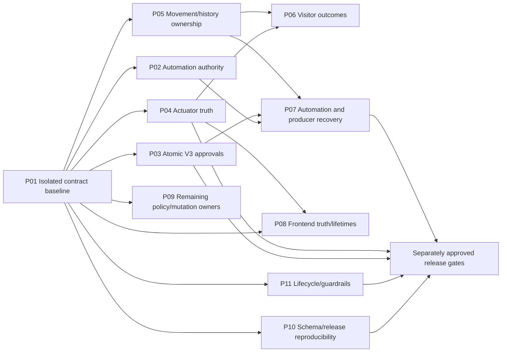

# Executable architectural recovery plan

Future work only. No package below was implemented by this audit. Findings and current evidence: [AUDIT.md](AUDIT.md). Proposed ownership/interfaces: [TARGET_ARCHITECTURE.md](TARGET_ARCHITECTURE.md). Starting baseline is dirty `main` at `69f9d8cfc1f77417a57105223f4e0772ae62de5d`, with substantial milestone 1–6 changes already present. **Rebaseline the actual worktree at the start of every package; never restore HEAD over those changes.**

## Recommended first authorization

Authorize **P01: a frozen, fully isolated execution-contract baseline and four bounded hazard probes**. It directly enables the selected strategy by establishing the smallest replacement boundaries for actuation, approval, authority and presence. It is not a general cleanup phase, dependency upgrade, deployment or hardware test.

P01 should produce reproducible evidence and the tests/fixtures needed by P02–P05. Existing passing contracts remain; newly identified violations are recorded honestly as failing safety probes, not relabeled passing behavior. The safest first behavior correction after that is P02's narrowly defined unknown-plate automation prohibition, followed by atomic V3 approvals and actuator outcome repair. Severity remains high for P04; its policy-dependent parts must not be guessed just to implement it earlier.

All packages use the current stack and audited command owners. A source/image release is separately authorized after implementation review. Source edits must happen in a verified isolated checkout if the main checkout remains bind-mounted into production; the Compose declaration makes this a real risk even without `docker compose up`.

## Dependencies and work order



The safety critical path is P01 → P02/P03/P04 → P05/P06 → P07, with P10's migration/rollback **characterization gate before any schema-changing release**. P10 need not freeze every historical migration before other code work can proceed. P08's non-command request-lifetime/report work and P09's pure rule/WhatsApp boundaries can proceed independently after baseline. P11 lifecycle tests can also proceed independently. Do not edit the same `chat.py`, `automations.py`, `access_devices.py` or frontend shell concurrently without an explicit file ownership assignment and integration review.

Relative size is a review/planning signal: S = one cohesive owner; M = several callers plus real persistence contracts; L = state-machine/cutover work; XL = split into the named reviewable slices. No precise person-day estimates are warranted until the probes and product decisions are complete.

## Common implementation and acceptance procedure

For each package:

1. Read AGENTS/focused docs and this package; capture root, branch, commit, full dirty status and source hashes. Inspect live mount metadata without secrets before choosing the checkout. Never discard, stash blindly, commit or push existing work without separate instruction.
2. Create a source snapshot containing tracked modifications **and every relevant new source/test/fixture**. Read test scripts before executing. Use loopback-only disposable PostgreSQL/Redis, synthetic identities/config/auth root, inert vendor sinks, no production socket/mount/credentials. Limit resources; own every task/container/process and clean them up.
3. Run the relevant unchanged-code baseline. Preserve failures and tool versions. Do not obtain green by weakening assertions, dropping options, broad ignores, excluding difficult tests or importing production-bound wrappers.
4. Implement one ownership/contract change; update all callers and remove its old path in the same reviewable slice. Keep a runnable application with one live owner. Where P01 adds an intentionally failing safety probe, label it a diagnostic acceptance failure; it is a documented exception to a wholly green new suite, not a successful release gate.
5. Validate exact source and dependency fingerprints. Run targeted contracts, real persistence tests where relevant, build/type checks and required architecture guards. Run the full isolated harness at the package release boundary, not repeatedly after unchanged passing results.
6. Update current ownership guidance and the exact deletion/compatibility entry. Record implementation diff, test manifest, unresolved policy, data compatibility and rollback build/source requirements. Release/deploy/hardware operation remains a separate task.

### Commands and their safety meaning

The existing command vocabulary is retained. P01 adds explicit constrained modes, rather than a second unrelated harness.

```bash
# Host-safe after inspecting these scripts; does not import IACS.
PYTHONDONTWRITEBYTECODE=1 python3 scripts/phase1/test_source_snapshot.py
git diff --check

# Full isolated harness ONLY when the implementation task authorizes
# dependency materialization and migrations into disposable resources.
# Repeat --include for each new source/test/fixture until tracked.
python3 scripts/phase1/validate.py --include <new-repo-relative-file>
```

Inside the harness network-isolated backend environment, use `python -m pytest -q -p no:cacheprovider` with the specific files listed below, then required full tests. Run `scripts/phase1/test_persistence.py`, `test_schedule_operations.py`, `test_feature_operations.py`, `test_notification_recovery.py`, `test_access_pipeline.py` only in its disposable DB namespace. Frontend `npm test -- --maxWorkers=1` and `npm run build` must run on the isolated snapshot with the lockfile's exact materialized dependencies. The audit's cached frontend pass is insufficient for release.

Use `python -m ruff check --no-cache <changed-owners>` and `python -m mypy --cache-dir=/tmp/mypy <typed-owners>` there. Retain existing targeted checks, expand as each owner becomes covered. `docker compose config --quiet` uses snapshot/default or explicitly synthetic configuration; never print expanded secret-bearing config. Never use `scripts/backend-pytest`, a Vite dev proxy to the live backend, or arrival/misread simulation API as an isolated test shortcut.

## P01 — Freeze and prove the safety boundaries

**Goal/findings:** reproducible baseline for IACS-01 / IACS-02 / IACS-03 / IACS-04 / IACS-12; determine minimum state/contract replacement. **Size:** M; uncertainty is test isolation and actual concurrency results, not code organization. **Dependencies:** none. **Preserve:** current public routes/tool catalogue, live behavior, all uncommitted source, existing test assertions and production state.

**Exact scope:** `scripts/phase1/validate.py`, `source_snapshot.py`, `test_source_snapshot.py`, `preflight.py`; existing `test_access_pipeline.py`/`test_persistence.py`; `backend/tests/contracts/` fixtures and `test_gate_commands.py`, `test_access_devices.py`, `test_chat_agent.py`, `test_automations.py`; `.github/workflows/backend-alfred.yml` only for the minimum matching isolated gate; `README.md`, `docs/validation/phase1.md`. Proposed `scripts/phase1/test_architecture_boundaries.py` may hold the bounded DB probes. No application logic, manifests, lockfiles or migrations change in this package.

**Preconditions/tests:** inspect existing harness, cached dependency fingerprints and dirty new files. New implementation authorization may allow installing **the existing locks only** in temporary dependency directories and migrating an empty disposable DB; it does not authorize changing project dependencies or production schema. If that is unavailable, mark locked/persistence checks blocked rather than using live resources.

**Steps:**

1. Extend the current harness with explicit reuse-dependencies/check-only controls, a configurable writable evidence directory, fail-closed source inclusion, and a manifest of source/image/runtime/dependency identity. Validate that no runtime path/symlink/env/secret enters the snapshot. A no-migration mode must not quietly run bootstrap or persistence suites needing schema.
2. Distinguish DB-free tests from persistence tests and identify the five audit failures' unmocked DB dependencies. Either provide explicit inert DB fixtures or move their classification; do not suppress the assertion or silently reach localhost production. Make isolated testing the default documented route; correct obsolete bootstrap/simulation claims.
3. Preserve a passing characterization matrix for existing intended contracts: known/visitor/unknown access, durable suppression, accepted-unverified/no open replay, generic confirmation binding, V3 preview/confirmation envelopes, partial notification acceptance and old-record review-only behavior.
4. Add four separately named inert safety probes: two-target aggregate order/partial outcome; denied-unknown event → real automation bridge → fake gate/garage; concurrent same V3 approval using fresh DB sessions; failed/pending grant + historical/Alfred presence repair. The diagnostic commands must report invariant violations explicitly. They may fail on current code; capture that evidence without xfail/skip disguises. Promote each to required passing contract in its repair package.
5. Make exact commands/source hashes and missing cases reproducible in a short handoff. Inspect fresh/historical schema setup behavior; reserve actual historical-baseline correction for P10.

**Removed ownership/old code:** unsafe default testing guidance and accidental production-selection path from the recommended workflow; no application path is removed. A no-live-resource guarantee replaces implicit environment dependence.

**Validation/acceptance:** five snapshot helper tests plus new constrained-mode tests pass; exact-lock backend/frontend baseline recorded; every new probe uses a recording sink and asserts no network/Docker socket; current hazards have inspectable results; no original source hash changes except authorized harness/tests/docs. Existing suite failures are resolved as isolation defects or reported, never hidden. Every audit-owned resource exits.

**Deployment/data/rollback:** no deployment, production data or migration changes. Revert only this package's isolated harness/tests/docs diff if needed. P01 is a coherent runnable checkpoint even if new diagnostic safety probes expose red results; it is deliberately **not** permission to release those hazards as acceptable contracts.

## P02 — Preserve recognition authority through automation

**Goal/findings:** IACS-02; hard unknown-plate invariant enforced across every automatic gate/garage entry. **Size:** S–M. **Dependencies:** P01 inert bridge probe. **Preserve:** legitimate schedule/webhook automation, notifications on unknown observations, dry-run behavior, existing rule records, catalogue/action IDs and public routes.

**Exact scope:** `backend/app/services/automations.py` (`normalize_actions`, rule validation, `_handle_realtime_event`, `_access_event_to_vehicle_trigger`, `_execute_action`); proposed `services/automation_policy.py`; `services/workflows/catalog.py` only if necessary for explicit provenance metadata; `services/access/payloads.py`; `backend/tests/test_automations.py`, `tests/contracts/test_workflow_contracts.py`, P01 boundary probe. No provider/coordinator rewrite and no UI builder redesign.

**Preconditions:** baseline verifies actual known/unknown decision fields and historical/skip-action contracts. The supplied unknown-plate prohibition already resolves that policy; phrase-user scope and other denied-known trigger policies remain explicitly separate decisions.

**Steps:** define typed origin/decision provenance at the event-to-automation boundary; create one narrow hardware admission function; apply configuration validation and execution-time enforcement; preserve historical/dry-run skip flags; record an explicit denied/skipped outcome for unsafe hardware action without suppressing safe notification actions. Existing stored unsafe combinations remain readable/auditable; do not silently delete, disable or rewrite live rules. New create/update rejection is a documented intentional correction, not cosmetic refactoring.

**Deletion:** remove hardware-action branches that accept a denied unknown generic dictionary merely because its actor label is Automation Engine. No second identity resolver is added to GateCommandCoordinator.

**Validation/acceptance:** execute existing automation/webhook/dry-run tests plus real bridge-to-inert-sink matrix for unknown gate/garage, known allowed/denied, schedule, webhook and historical events. Zero unknown-triggered hardware calls; durable reason and unchanged notification behavior; no bypass through alternate action spelling/catalog registration. Full isolated baseline at handoff.

**Deployment/data/rollback:** code-only unless an additive provenance field is essential. Existing rule interpretation changes only for the documented unsafe case; release notes identify behavior change. A rollback must not re-enable unsafe execution; use a prebuilt compatible hold/guard build if a forward fix fails. No live rules edited in implementation. Main uncertainty: intended policy of other trigger scopes, excluded from this package.

## P03 — Replace V3 pending approval storage and claim

**Goal/findings:** IACS-03; one current-actor, atomic approval execution across HTTP/WS/messaging. **Size:** L, split below. **Dependencies:** P01 concurrent/demotion/envelope tests; P10 schema/rollback characterization before release. **Preserve:** V3 planner, 84-definition public tool catalogue, tool input/outcome envelopes, pending confirmation IDs/expiry and existing confirmation routes, shared/private channel scope and all audit/history records.

**Exact scope:** `services/chat.py` pending-action helpers and definitive tool execution; proposed `services/alfred/approvals.py`; `services/alfred/permissions.py`/`executor.py` for one current permission check; `ai/context.py` for trusted operation identity; `models/core.py` and a new additive Alembic revision if needed; `api/v1/ai.py` adapters; `messaging_bridge.py`; `ai/tool_groups/gate_maintenance_handlers.py` and only other handlers needing stable trusted operation IDs; tests for chat/context/Alfred execution and a proposed `scripts/phase1/test_alfred_approvals.py`. Frontend fallback cleanup is the final small contract slice below.

**Preconditions:** characterize private HTTP session vs intentionally shared Discord session access; preview cancel/expiry/error/stream routes; role-demotion behavior; exact generic ActionConfirmation protocol. Prefer a dedicated AlfredApproval row because conversation context is mutable and generic token confirmation has a different external protocol; reuse existing active-actor/schema invariants, not a universal approval framework.

**Reviewable slices:**

1. Add record/store with immutable action/actor/session/arguments-or-references/expiry/operation identity, atomic conditional claim, attempt/terminal/review status and inert persistence tests. No live caller switch; no background replay worker. This is a short-lived inert schema seam, consumed in slice 2; do not deploy a dormant parallel executor.
2. Switch preview/confirm/cancel in all V3 transports to that owner. Resolve current actor/tool permission immediately before claim/execution; preserve actor binding and schema validation. Commit claim before external work, pass stable identity to supported domain owners, record result after. A crash with uncertain invocation becomes review-required; never automatically retry. Remove `_load/_clear/_store_pending_agent_action` JSON mutation and all definitive execution bypasses in this same switch. No dual approval execution.
3. Expire pre-cutover unattempted JSON approvals with an explicit fresh-preview message (preferred, avoids guessing which old actions executed); retain old context/history as inert data. After supported response fixtures prove every valid approval includes its ID, delete frontend `chatConfirmationAction` and unused argument fields in `ChatWidgetView.tsx`; missing ID becomes a recoverable protocol error with no send. No historical messages are deleted.

**Validation/acceptance:** P01 approval probe becomes a passing contract; concurrent confirm/confirm, cancel/confirm, different actor, demoted Admin, inactive user, expired approval, two transports, unrelated context save, crash-before-invoke and after accepted fake action. One operation identity and at most one invocation per approval; zero hardware/send from preview or unauthorized confirmation; catalog/execution/stream fixtures remain compatible. A normal same-widget guard is not used as proof of server atomicity.

**Deployment/data/rollback:** additive table/revision, preserve all old rows. Stop old backend workers for cutover; do not allow old JSON writer and new approval store to authorize concurrently. Compatibility projection may read old preview for display only; default fresh preview at cutover. Post-claim new records cannot be safely rolled back to the old JSON executor. Rollback build must recognize additive revision, leave new approvals review-only, and require fresh preview; never copy attempted approvals back into executable JSON. Main uncertainty is session sharing/privacy policy, not reason to retain unsafe concurrent execution.

## P04 — Make actuator intent, delivery and physical evidence truthful

**Goal/findings:** IACS-01, supports IACS-04 / IACS-05 / IACS-08. **Size:** L. **Dependencies:** P01 outcome/lease tests; D1/D2/D4 below; P03 operation identity shape coordination. **Preserve:** existing coordinator/device paths, routes and global gate endpoint behavior until explicitly changed, valid HA/ESPHome protocols, acceptance/reconciliation history, intended malfunction recovery and no automatic open replay.

**Exact scope:** `modules/access_devices/base.py`, `home_assistant.py`, `esphome.py`; `modules/home_assistant/client.py`; `services/access_devices.py`, `gate_commands.py`, `movement_ledger.py`, `movement_reconciliation.py`; `modules/gate/base.py`, `modules/gate/access_devices.py`; relevant model/revision only if required; `api/v1/integrations.py`; `frontend/src/api/accessCommands.ts` (proposed) and `views/DashboardView.tsx`; gate/device/malfunction/persistence/command-contract tests.

**Preconditions:** define required-target aggregate semantics, manual selected vs global action, and accepted-unverified close policy using configured service semantics and product intent. No live command is needed to create tests. Review historical row compatibility and fresh evidence attribution. Do not misclassify HA successful-send/state-read failure or ESPHome sample timeout—they already retain unknown safely.

**Steps/deletion:**

- Introduce delivery certainty at provider boundary: not dispatched vs explicit rejection vs accepted vs possible delivery. Stop converting post-send HTTP uncertainty into ordinary unavailable. Retire catch-all exception→failover behavior only where dispatch is uncertain; retain genuine pre-dispatch failover.
- Record exact targets and stable per-target attempts before I/O. Prefer extending current ledger metadata where atomicity is sufficient; use child records only with evidence. Preserve partial acceptance and per-target unknown; remove first-result aggregate state/verification inference.
- Fence expired lease/repeated independent intent against uncertain prior dispatch; resolve via target/time/attempt observations. Delete uncorrelated current-first-gate success shortcut, preserving evidence that supports legitimate reconciliation.
- Decide and implement close retry behavior explicitly. Existing tests that expect retry are changed only alongside approved contract change and new ambiguity tests, not quietly preserved or removed.
- Make Dashboard confirmation describe the actual target scope; initially keeping the global endpoint and labeling the set is the smallest compatible change. A new per-device gate intent is additive only if approved. Display receipt ID, partial/accepted/unknown/observed state and recovery; never offer automatic resend because a refresh failed.

**Validation/acceptance:** accepted-then-lost-response fake, pre-send refusal, explicit rejection, open/close, verified/unknown/rejected target permutations, unrelated later observation, duplicate/expired lease race, crash after dispatch before persistence, garage path, and malfunction intent identity. No accepted/unknown target is resent; aggregate independent of list order; confirmation targets equal recorded fake calls. Existing provider/FSM/public contract suites remain.

**Deployment/rollback:** code-only outcome correction may precede additive attempt schema. For richer records, stop old executors during cutover; old readers may project legacy fields but cannot retry unknown states. Backward-compatible schema stays. Keep per-target evidence during rollback; a compatible hold build is preferable to reverting uncertainty protection. No live hardware test is implied; a supervised test requires a separate exact confirmation after release readiness.

## P05 — One eligible movement/presence owner, including history

**Goal/findings:** IACS-04 and historical part of IACS-14. **Size:** M–L. **Dependencies:** P01; P04 receipt semantics for richer eligibility, though direct stale-writer correction can land earlier. **Preserve:** event/saga IDs, durable suppression, history/backfill without hardware, existing direction FSM and report/audit behavior.

**Exact scope:** `services/movement/presence.py`, `movement/sessions.py`, `movement_ledger.py`, `movement_reconciliation.py`; `services/access/execution.py`; proposed `services/access/historical.py`; `restart_backfill.py`; `ai/tool_groups/access_incident_handlers.py::backfill_access_event_from_protect`; related presence/access/restart tests and `scripts/phase1/test_access_pipeline.py`.

**Preconditions:** specify eligible outcome and deterministic equal-time tie policy; classify historical/no-command/external admission records separately from allowed-but-failed command. Preserve current camera/direction rules. Characterize already persisted rows; do not reinterpret all historical GRANTED records automatically.

**Steps:** create one atomic compare/upsert or locked transition for eligible movement; return whether presence actually changed. Retarget live/reconciler/restart. Add one explicit historical operation that writes event/saga/session/pass link/audit via existing participants with **no actuator capability**. Alfred handler retains confirmation/evidence/presentation only; restart retains discovery/cursor only. Delete direct Alfred Presence writes, latest-GRANTED shortcut and duplicate history construction in the cutover. Move HA presence projection after committed changed outcome.

**Validation/acceptance:** failed/ambiguous latest grant cannot update presence through history; yesterday repair cannot overwrite today; concurrent old/new and equal-time cases deterministic; missing-row race succeeds once; historical replay produces no gate/garage/message calls and no duplicate records; normal live access/reconciliation still works. Full seven scenarios and targeted PostgreSQL suites.

**Deployment/data/rollback:** prefer code-only ownership first. Any repair of existing incorrect presence is a separate approved, audited operation with preview, backup and per-row evidence; do not silently reprocess live history. Rollback can restore code with same schema but must not re-enable direct stale writes; retain a guarded fallback build. Unknown historical eligibility remains explicit review data.

## P06 — Separate visitor validity, reservation and completed outcome

**Goal/findings:** IACS-05. **Size:** L; product-policy uncertainty is material. **Dependencies:** P04/P05 and D3/D4 decisions. **Exact scope:** `visitor_passes.py` (claim/window/lifecycle/update/cancel/arrival); `access/evidence.py`, `execution.py`, new historical operation; `icloud_calendar.py`, `messaging/visitor_conversation.py` or new owner; `api/v1/visitor_passes.py`/Alfred adapters only for compatible projections; VisitorPass model/additive revision if needed; visitor/calendar/access/sandbox/phase1 tests.

**Preserve/preconditions:** plate-unbound one-time vs exact-plate duration matching, half-open vs inclusive windows, closest-pass matching, duration reentry, privileged-plate refusal, consent/privacy/abuse protections. Decide consumption point and rejection/unknown recovery. Evaluate captured-time evidence separately from permission to actuate now; choose allowed lateness and revocation recheck. Capture DST spring-forward/fold behavior explicitly; do not implement guessed temporal policy.

**Steps/deletion:** pure as-of validity result; explicit reservation with conflict/cancel semantics; outcome transition owned by visitor service; lifecycle display state projected without erasing historical validity facts. Locks/versions cover claim-vs-update/cancel/lifecycle; channel source metadata merges scoped keys. Delete mutation from “evidence-only” resolution and overloaded pre-command arrival/consumption path after outcome parity. API fields remain projected or any change receives separate approval.

**Validation/acceptance:** valid pass + rejection/unknown/accepted/verified/passage cases match approved policy; delayed event after wall-clock expiry and revocation boundaries; two simultaneous arrivals; cancel/claim race; calendar resync and visitor window request; London DST inclusive/half-open fixture matrix. No unknown observation gains authorization because of historical replay.

**Deployment/data/rollback:** additive reservation/outcome fields or table only if needed. Map old USED/arrival as legacy evidence, not proof of physical passage. New reservation/consumption semantics require old worker exclusion. Preserve rows on rollback, keep a compatible projection/hold; once new lifecycle states exist, bare old code rollback is insufficient. Do not auto-release unknown accepted reservation for another hardware attempt.

## P07 — Recover required work without replaying uncertain side effects

**Goal/findings:** IACS-06, automation state ownership part of IACS-07. **Size:** XL; three independently released slices. **Dependencies:** P02/P03/P05, P04 outcomes; P10 migration/rollback gate. **Preserve:** existing rule IDs/catalogs/routes/cron/dry-run/webhook security, notification versioned recovery, partial delivery behavior and old unfinished review-only records.

**Exact scope:** `automations.py`, proposed `automation_execution.py`, `automation_policy.py`, `automation_integration_actions.py`; AutomationRun/related proposed action records; `notification_runs.py`/`notification_dispatch.py` only for explicit intake contract; `domain_events.py`; producers `access/execution.py`/`enrichment.py`, `visitor_passes.py`, `icloud_calendar.py`, `gate_malfunctions.py`, messaging webhook/conversation; relevant contracts and proposed phase1 recovery tests.

**Preconditions:** D5 delivery obligations/freshness; stable origin and action IDs; enumerate all action kinds and direct messaging sends. Do not infer exactly-once provider delivery or reuse notification retry rules for hardware.

**P07a — Automation journal:** commit a durable occurrence before action; immutable action plan/target criteria; claim with DB time/token fencing; commit attempting before I/O and outcome after; domain calls receive stable action ID. Scheduler writes occurrence and advances next-run atomically; dispatcher discovers pending occurrences without an in-memory-only handoff. Historical claimed/running rows stay review-only. Delete old execute-loop/claimed-list handoff when all callers switch; no concurrent old/new action loops.

**P07b — Required origin handoffs:** one origin at a time (access, visitor/calendar, gate-malfunction adapter). Origin transaction inserts unique typed delivery/automation intent; intake creates/reuses run ID and marks handoff accepted atomically or by unique idempotent protocol. Keep EventBus only as wakeup/display. Delete required-delivery listeners that depend solely on transient events once origin parity is proven. Keep existing gate outbox identity; do not create a second outbox for it. Optional enrichment remains explicitly optional.

**P07c — Messaging intake/request recovery:** distinguish received/claimed/handled/review state; dedupe does not discard unhandled work. Durable visitor buffer wakeup is recoverable; do not remove message before domain handling commitment. Replies have documented attempt/unknown semantics; never auto-resend an uncertain provider action. Durable submitted feedback gets a bounded stale/analyzing review/resume policy; optional reflection need not become a workflow engine.

**Validation/acceptance:** real isolated DB boundary matrix at origin commit, claim, before/after provider, checkpoint failure and late worker; lost wakeup recovery; stable occurrence ID; exact no-repeat accepted action; no old unknown work replay; expiry/review visible to Admin via existing/read-only extension. All notification recovery tests remain unchanged unless an explicitly approved contract changes. Dry-run invokes zero writes/providers.

**Deployment/data/rollback:** additive recovery_version and action/provenance states, old readers tested; no new records executable until one-owner cutover. Reconcile historical pending inventory as review-only, never set “pending” to invite replay. Compatible rollback build understands revision, pauses new/unknown actions and preserves accepted checkpoints. Code rollback alone becomes insufficient after new actions are claimed/attempted; prepare hold build before release. Backups/restores use P10 protocol.

## P08 — Frontend truth and lifetime repairs

**Goal/findings:** IACS-08 / IACS-09, UI parts of IACS-01 / IACS-03. **Size:** M per slice. **Dependencies:** P01; command receipt slice depends on P04; fallback removal on P03. **Preserve:** UI workflows, routes, lazy loading, current schedule/workflow modules, relative API transport, export URLs/snapshots, user drafts and visual style.

**Exact scopes / reviewable slices:**

- **P08a request lifetimes:** `views/ReportsView.tsx`, `DirectoryViews.tsx` DVLA lookup, `IntegrationsView.tsx`, `features/investigations/hooks.ts`; inspect `AlfredTrainingView.tsx`/`SettingsViews.tsx` equivalents. Add adjacent deferred-promise tests. Remove started-not-completed refs; advance generation on all input changes; cancel stale scopes; clear loading state on query reset. Extend only proven neutral primitives; no new state framework.
- **P08b session socket:** extract proposed `app/useRealtimeConnection.ts` from `app/App.tsx`, preserve `realtimeEvents.ts`, `realtimeRefresh.ts`, `useShellRefresh.ts`, `refreshCoordinator.ts`. Route changes update current consumer without changing transport identity. Delete old effect; tests use fake WebSocket/timers/visibility/account changes.
- **P08c server report preview:** `backend/app/services/reports.py`, `api/v1/reports.py`, proposed `frontend/src/api/reports.ts`, `views/ReportsView.tsx` (move into feature only if ownership benefit). Add read-only endpoint reusing current snapshot builder, no artifact/ReportExport mutation; delete browser attribution/duration/history calculator after semantic fixture parity. Decide site-timezone/completeness before API naming. Preserve exports/PDF behavior.
- **P08d critical wire contracts:** typed command receipt/V3 pending/event envelopes plus paired Python/TS fixtures; extend ownership checks across completed features. Delete ID-less ChatWidget fallback after P03, never add direct tool-argument execution fallback.

**Validation/acceptance:** late A cannot overwrite B; cancelled read retries; load-more works after query change; navigation keeps one socket and account switch cleans old messages; reconnect full current-route refresh once; >250-event report and previous-arrival/DST/timezone parity; missing confirmation ID emits no action; backend field/event rename fails paired tests. Exact-lock Vitest/build; browser responsive/keyboard smoke using synthetic isolated data before release. No broad CSS cleanup.

**Deployment/data/rollback:** primarily code-only/additive preview API. Preview runs read-only; no data migrations. Retain old endpoint for external consumers. Keep server/client image versions compatible; with static frontend assets, rollback is matching built image, not source change alone. Main uncertainties: declared preview completeness/timezone and external clients.

## P09 — Complete operation ownership and remove backwards dependencies

**Goal/findings:** IACS-07 / IACS-14. **Size:** M per slice. **Dependencies:** P01; visitor policy extraction coordinates with P06. **Preserve:** canonical rule validation, active-Admin constraints, machine automation source/audit, visitor consent/privacy, integration delivery behavior.

**Exact scopes / steps:**

1. `notification_rules.py` + proposed `notification_policy.py` + `notifications.py` + `automations._toggle_notification_rule`: move cohesive pure normalization out of delivery dependency; add authorized machine activation transaction participant. Retarget API/Alfred/automation and delete direct is_active assignment. Test concurrent edit/toggle and exact audit source.
2. `maintenance.py`, `settings.py`, their APIs and `telemetry.write_audit_log`: put required audit in same mutation transaction; make commit ownership explicit. Preserve best-effort diagnostic emit for nonmandatory traces; post-commit publish errors cannot misreport a saved operation as unsaved. Test failure before commit and after commit separately.
3. `whatsapp_messaging.py`, all `services/messaging/*`, `messaging_bridge.py`, `visitor_passes.py`, proposed `visitor_conversations.py`: extract channel-neutral window/consent/request policy and inject narrow collaborators; all callers import real owners, no wm facade backreferences or wildcard export dependencies. Retire facade only after runtime registry, imports, API/service constructors and tests are migrated. Preserve private sender sandbox and shared Admin bridge.
4. `access/evidence.py`, `execution.py`, provider evidence use sites: acquire optional vision/Protect evidence outside transaction; short transaction revalidates mutable permissions/reservation; keep exact direction policy/failure behavior. Delete provider imports/I/O from policy/transaction owner where the new seam makes them unnecessary.

**Validation/acceptance:** rule-only import/test requires no providers; one approved writer per rule/maintenance mutation; no audit gap on rollback; visitor flows reuse policy through a second inert channel; concurrent scoped metadata saves preserve independent data; five-module WhatsApp runtime cycle removed; delayed fake vision does not hold DB transaction. Existing privacy/sandbox/catalog/access contracts pass.

**Deployment/rollback:** code-only first; data moves only if scoped atomic metadata cannot suffice, requiring separate P10 gate. Delete old facade in the caller-migration slice, not a later unowned phase. Preserve external API import compatibility only where an actual consumer is demonstrated, with explicit sunset; private tests are retargeted, not supported via production shims.

## P10 — Reproducible schema, update candidates and rollback

**Goal/findings:** IACS-10 / IACS-11 / IACS-12. **Size:** M–L per slice. **Dependencies:** P01; characterization is prerequisite to schema-changing releases. **Preserve:** all existing revision IDs, tables/data/history, locked stack, bind mounts, updater/Protect features, operator approvals and separate deployment.

**Exact scopes:** all `backend/alembic/versions/` plus `env.py`/`db/migration_policy.py`/`bootstrap.py`; `backend/tests/test_schema_dependency_order.py`; phase1 migration checks; `services/dependency_updates.py`, `tests/test_dependency_updates.py`, API/UI only for truthful stage labels; Dockerfiles/Compose and `.github/workflows/backend-alfred.yml`; manifest/lock files are test fixtures until an actual dependency update is separately authorized.

**P10a schema characterization/freeze:** reconstruct schemas at meaningful historical revisions (initial, pre-notification-run, pre-recovery, current), compare empty vs incremental upgrades and downgrade guards in disposable DB. Preserve narrowly retained historical column. Propose exact frozen migration-local DDL/schema for initial revision; changing historical revision execution semantics requires explicit approval and equivalence proof. Do not delete/reorder/squash revision history or rely on current ORM create_all as a historical specification. Preserve old fixture database and SQL evidence for review.

**P10b complete candidate/restore:** include `backend/uv.lock` with pyproject and all existing frontend/build inputs in backup and candidate; validate existing lock and install/build only in isolated staging. Promote an atomic versioned candidate/manifest set or recoverable controlled transaction, never one file while leaving a stale lock. Distinguish source-prepared, built/verified and deployed states. Restore proves exact hashes and schema compatibility, not compileall “health.” Interrupted jobs get an explicit review status; no automatic update/deploy resume.

**P10c CI/release proof:** CI materializes backend from locked dependencies; runs critical PostgreSQL scripts and schema equivalence checks in isolated services, plus exact-lock frontend. Use reviewed source/image/lock/schema manifest for release, recognizing backend source mount can override image contents. Do not expand infrastructure. Inventory whether updater socket/idle container still has external operational consumers; retire only after evidence and separate scope approval, not from lack of local callers.

**Validation/acceptance:** old/fresh schemas equivalent at stated checkpoints; historical recovery rows never replay; downgrade refuses evidence loss; mock update failing after each file stage promotes neither inconsistent pair; restore hashes and locked build match; failed jobs retain status/evidence; CI command selection equals local isolated critical gate.

**Deployment/data/rollback:** rehearsal first on synthetic/approved isolated data. Before actual schema/source release: approved consistent DB/data/artifact/auth-root backup with secret-safe handling, isolated restore verification, current head/source/image manifests, forward and compatible rollback builds. Stop old writers for state ownership cutover. Additive migrations first; new-code activation second. After new semantic records are written, retain additive schema and compatible hold/rollback code; never raw downgrade/delete statuses as rollback. Full data restore loses post-backup writes and requires a distinct recovery decision, not an automatic script. No backup/restore/migration/deployment occurs in this audit.

## P11 — Lifecycle ownership and enforceable guardrails

**Goal/findings:** IACS-13 and durable prevention of IACS-04 / IACS-07 / IACS-09 / IACS-12 / IACS-14. **Size:** M. **Dependencies:** P01; rule baselines tighten as owners land. **Exact scope:** `backend/app/main.py`, service start/stop/task sites, `telemetry.py`, `api/v1/health.py`, Docker healthcheck only after contract choice; existing backend architecture tests, proposed ownership test, frontend `frontendOwnership.test.ts`/guardrails, CI; AGENTS and focused ownership guidance.

**Preserve/preconditions:** actual start dependencies, optional integration behavior, backend liveness route compatibility, stopped-service cleanup, current runtime recovery. Classify critical readiness vs optional degradation; no every-vendor-is-required policy. Mandatory audit belongs to mutation, not shutdown drain.

**Steps:** register cleanup immediately after each successful start using explicit standard-library lifetime management; bound cancellation/drains and attempt all cleanups even if one fails; track task/subprocess ownership and close resources. Correct readiness meaning while keeping existing health clients compatible (additive readiness route/status if needed). Add AST/model-writer and cross-language contract guards described below. Update concise guidance as owners actually land; retire obsolete instructions, not historical evidence.

**Validation/acceptance:** injected failure at every start/stop position cleans every successfully started fake exactly once, no tasks/child processes left, timeout bounded; optional integration outage doesn't kill required access policy; critical worker failure surfaces distinctly. New backwards import/writer/event-contract violations fail CI; existing allowlist cannot grow without a reviewed architecture decision.

**Deployment/rollback:** code-only or additive health contract, matching Docker client compatibility; no provider action. Rollback retains readiness clarity and task cleanup where possible. No process count/performance improvement claim without measurement.

## Schema/cutover and rollback matrix

| Change | Mixed-version rule | Point simple code rollback stops being sufficient | Recovery approach |
|---|---|---|---|
| Atomic Alfred approval rows | Old JSON executor excluded; old previews display-only/fresh preview | New approval claimed/attempted | Keep schema + record; compatible build leaves review-only, fresh preview for new intent |
| Target/action attempt journal | One command/automation executor per versioned record | Provider attempt recorded or delivery uncertain | Preserve checkpoint; no replay; compatible hold + attributed reconciliation |
| Visitor reservation/outcome | Old claim/lifecycle writers excluded at cutover | New lifecycle outcome/reservation persisted | Compatible projection/hold; operator-reviewed resolution; no auto-release uncertain admission |
| Required origin outbox/inbox | Unique origin/version; one canonical consumer, duplicate wakeups harmless | New origin commitments require delivery owner | Keep intake compatibility and unique IDs; never both raw-event and outbox action paths |
| Schema baseline correction | All existing revision IDs retained; tested fresh/incremental semantics | Corrected schema/current data accepted | Keep approved migration code/history; restore only through rehearsed plan |
| Preview/lifetime UI | Additive API; old frontend remains readable | Normally none, unless separate data migration added | Matching frontend image/source; no business data rollback |

A migration seam is allowed only with a named owner, exact callers, version eligibility and removal gate. Never leave permanent “old/new/V2” execution branches. Data/history projections may outlive code because retention is a separate product obligation; they cannot become executable fallback paths.

## Deletion and decommission schedule

| Package / owner | Delete or retire in same reviewed slice | Removal gate |
|---|---|---|
| P01 validation owner | Live-selecting test wrapper as recommended default; stale bootstrap/simulation advice | Isolated documented command works from fresh snapshot; actual wrapper retirement depends on developer consumers |
| P02 automation owner | Unknown-denial → hardware authority-loss branch | Real bridge inert no-actuation matrix green |
| P03 approval owner | Executable pending-action JSON writes/load-clear invocation path | All HTTP/WS/messaging callers on atomic store; old pending previews inert |
| P03/P08 UI owner | ID-less named-tool confirmation fallback and unused arguments | Valid/malformed/expired V3 response fixtures; missing ID sends nothing |
| P04 actuation owner | Ambiguous exception → failover; first-target verification; uncorrelated success shortcut | Outcome/target/lease/observation matrix and approved close policy |
| P05 movement owner | Direct Alfred presence/event orchestration and latest-GRANTED shortcut | All three callers use one eligible history/movement owner; no-actuation replay |
| P06 visitor owner | Implicit pre-command arrival/consumption if policy rejects it; status-only historical validity | Approved policy and migration projection parity; no silent reinterpretation |
| P07a automation owner | Old final-only execute loop and in-memory-only claim handoff | All action kinds journaled, one executor, old unfinished records review-only |
| P07b/c origin owners | Required transient-event-only delivery listeners and dedupe-as-completion path | Origin/inbox/run identity coverage, lost-wakeup/crash matrix |
| P08 frontend owner | Local report history/duration attribution; stale started flags; route-owned socket effect | Parity/deferred-response/socket tests |
| P09 domain owners | Automation direct NotificationRule writes; WhatsApp wm backreferences/facade | Writer/import checks and all registered callers migrated |
| P10 release owner | Mutable-current-model baseline semantics after approved freeze; incomplete candidate promotion/restore | Historical equivalence and backup/restore/locked build proof |
| P11 composition owner | Cleanup-after-all-starts pattern and unowned critical tasks | Full fake start/stop failure matrix |
| Deferred external workflow decision | `v2-p06-privacy-review.yml`, idle updater exposure, retained legacy column | Verify remote callers/configuration/data-retention first; no deletion scheduled without evidence |

Already removed old Alfred/snapshot/frontend files listed in AUDIT are guarded against reintroduction, not counted as future deletion achievements. Decommission completion means actual callers/branches disappear; moving them under `legacy/` does not qualify.

## Enforceable rules and acceptance gates

Use existing tools and concise current guidance. Initial baselines are in TARGET_ARCHITECTURE.md.

- Python AST checks: pure access/tool/context/notification/automation policy cannot import ORM/session/providers/registries; domain operations cannot import API/Alfred/transport handlers; messaging implementation cannot import its old facade. Count function-local and type-only edges separately so moving imports inside functions does not “fix” coupling.
- Writer checks: baseline exact assignments/SQL mutation sites for Presence, VisitorPass lifecycle, NotificationRule activation, approval and action states; permit only the named owner/transaction participant. AST checks are a guard, not proof against dynamic SQL; pair with transaction integration tests.
- Side-effect tests: all actuation paths use audited owners; all denied-unknown/historical/dry-run inputs get zero hardware calls. Provider post-send uncertainty stays ambiguous, not fallback. New direct vendor I/O in adapters/handlers fails guardrails.
- Contracts: paired Python/Vitest fixtures for command receipt/target, V3 pending ID/outcome and realtime impacts. Catalog source remains backend; no frontend fallback catalogs. Public route/schema snapshots from an isolated app with startup disabled or static model export—not live startup with credentials.
- Persistence: concurrent sessions, stale claims/late workers, cancellation before/after I/O, rollback-before-commit, unknown after attempted delivery. One notification action can fan out internally; tests must not claim endpoint-level exactly-once.
- CI: exact lock fingerprints, complete source inclusion, unit + isolated critical persistence, schema equivalence, frontend tests/build, selected type/lint plus no-new-violation baseline. Current 639 broad lint diagnostics are backlog, not permission to disable lint or mass-format unrelated files.
- Review scope: change must name removed owner/duplicate rule/hidden side effect. A folder move or lower LOC cannot satisfy acceptance. An architecture decision is required for authority, persisted meaning, guarantees, public compatibility or rollback change; normal feature organization needs no long document.

Common future-change scenarios and estimated target surfaces are in TARGET_ARCHITECTURE.md. Measure actual changed ownership sets after implementation (new recognition source, visitor rule, notification destination, new Alfred mutation); do not optimize arbitrary file counts.

## Implementation decisions accepted 2026-09-12

Implementation is now authorized in an isolated checkout. The audit remains a
historical record; live deployment, data changes, hardware tests, commit and push
remain excluded. [IMPLEMENTATION_STATUS.md](IMPLEMENTATION_STATUS.md) records the
actual source baseline, work ownership, package progress and retained evidence.

| Decision | Accepted contract |
|---|---|
| D1 | Selected manual gate; omitted target preserves global API. An explicitly configured designated entry gate establishes admission. Other targets report independent outcomes. No inferred entry designation; release activation requires operator selection. |
| D2 | Never automatically retry or fail over after possible transmission, including close. Reconcile first. |
| D3 | Reserve one-time pass; consume on verified designated-entry opening, release on definite rejection, hold unknown. Authorized arrival plus fresh already-open evidence consumes without sending. Preserve current plate matching/window contracts. |
| D4 | Recognition maximum age 60 seconds; recheck current permissions immediately before new sends. Historical replay remains inert. Future capture timestamps cannot extend durable receipt freshness. |
| D5 | Durable operational notifications/automation/incoming-message acceptance; optional enrichment/typing. Unattempted scheduled hardware may catch up within 60 seconds with fresh active-rule/precondition checks. Unknown sends review-only. Existing notification maximum dispatch age remains 900 seconds. |
| D6 | Current active Admin plus requester-bound approval for Alfred/phrase hardware; shared history does not transfer approval. Preserve existing conversation-sharing behavior. |
| D7 | Preserve unverified external compatibility consumers and readable history; retirement requires evidence and named owner. |
| D8 | Characterize schema before any model merge, preserve revision identifiers, then freeze baseline semantics with equivalence proof. Compatible source/image/schema hold builds and restore evidence precede separately authorized release. |
| D9 | Complete read-only backend-owned preview, same calculations as export, site timezone. |
| D10 (2026-09-13) | Full-flow simulation is isolated-test-only. Production rejects before simulation mutation; no operator override enables the global-service simulator. Separate arrival/misread routes retain their existing contracts. |

### Sequencing and multi-agent corrections

- P01 explicitly includes lost-provider-response and expired-lease/reconciler
  probes in addition to the four audit probes. Harness changes stay bounded.
- P10a schema characterization precedes **every new model/revision merge**,
  because the current initial migration imports current ORM metadata.
- P03's inert store is a merge checkpoint; backend and paired frontend cutover
  must follow before claiming an architectural improvement.
- One lead integrates all shared models, migration revisions, fixtures, CI and
  lifecycle wiring. Up to three agents use exclusive file lists.
- One frontend owner implements all P03/P04 client changes and P08. Report
  lifetime and preview changes are sequential under that owner.
- Split P05 into current-record atomic eligibility, then receipt/history
  integration. P06 follows the latter. Preserve historical caller semantics.
- Keep P02/P07 automation changes with one owner. Hardware denied by policy is
  skipped so safe notification actions still execute. P09 notification activation
  ownership precedes replacement of the action loop.
- Split P07 into occurrence/action store, executor cutover, per-origin handoffs,
  messaging intake and feedback recovery. Messaging extraction precedes recovery
  under one owner. Reuse the existing malfunction outbox and notification journal.
- P11 fault tests can start early; final worker registration follows stabilized
  dispatcher contracts. Full combined-source harness runs are serialized.

## Ready-to-use implementation prompts — future only

### Prompt 1 — P01: isolated contract baseline

> Implement only P01 from `docs/architecture-review/REMEDIATION_PLAN.md` in `/Users/jas/Documents/Intelligent Access System`. Read AGENTS, focused backend/hardware/frontend guides and the audit first. Preserve the dirty worktree and record commit/status/source hashes. Verify source bind mounts and work in an isolated checkout if main is mounted into the running backend. No application behavior changes, dependency-version changes, production migration/deploy, live API/controller/notification calls, commit or push.
>
> Extend the existing `scripts/phase1` harness, not a parallel runner, with explicit safe reuse/check-only modes and complete source/dependency fingerprints. Exact existing locks may be materialized only into disposable test directories; empty disposable PostgreSQL/Redis may be initialized/migrated for these tests. They must have no external route, production config/data/socket or credentials. Every external action uses recording inert sinks. Inspect scripts before execution, bound resources and clean all owned processes/containers.
>
> Scope: `validate.py`, `source_snapshot.py`, `test_source_snapshot.py`, `preflight.py`, existing phase1 persistence/access tests, focused backend contract fixtures/tests, minimum CI parity and test/simulation documentation. Add a bounded `test_architecture_boundaries.py` under phase1 if useful. Characterize four cases: gate aggregate ordering/partial truth; unknown-denied event through automation to fake gate/garage; concurrent V3 confirmation with fresh DB sessions; pending/failed grant plus restart/Alfred presence repair. Keep intended-contract tests distinct from diagnostic probes that expose current hazards. Do not xfail/skip/weaken assertions to call the new probes green.
>
> Completion: exact-source/lock baseline, five unexpected DB-dependent test paths explicitly isolated/classified, repeatable inert probe results, no original source changes beyond authorized scope, existing checks preserved, clear failing/blocked/passing labels, no task resources left. Run snapshot tests, relevant pytest/persistence/contract suites, exact-lock frontend tests/build and diff check. Report which subsequent package each hazard enables. Stop before fixing any application finding or deploying.

### Prompt 2 — P02: unknown-plate automation authority

> Implement only P02 from `docs/architecture-review/REMEDIATION_PLAN.md` after P01's isolated source/dependency baseline and real bridge probe are available. Re-read current source/AGENTS; preserve unrelated dirty changes and use an isolated checkout if needed. No deployment, live rule edits, controllers, notifications, dependency changes, unrelated cleanup, commit or push.
>
> Enforce the supplied invariant that denied unknown recognition cannot cause automated gate or garage actuation. Inspect `services/automations.py`, `access/payloads.py`, `workflows/catalog.py`, current coordinator/device contracts and the P01 probe. Establish a narrow `automation_policy.py` owner for typed provenance/admission if it removes the repeated policy. Apply both create/update validation and execution-time protection. Preserve all public rule/action IDs, legitimate schedules/signed webhooks, dry-run/historical suppression and notification actions for unknown observations. Existing unsafe rules remain readable/auditable; no silent migration/deletion/disabling of live data. Record explicit denied/skipped hardware outcome. Do not make GateCommandCoordinator re-resolve identities or broaden into phrase/Standard-user product policy.
>
> Tests must exercise the actual event bridge/rule selection into recording gate/garage sinks for denied unknown, known allowed/denied, scheduled, signed webhook and historical/dry-run inputs. Zero unknown-triggered hardware calls is required. Preserve other behavior; any changed configuration error/status must be documented as the intentional safety correction. Use only disposable isolated persistence and current locked dependencies under the inspected harness. Run automation/webhook/workflow contracts, P01 probe promoted to a passing invariant, full required isolated checks and diff check.
>
> Completion: one admission owner, no generic event-dictionary authority bypass for unknown recognition, durable reason/audit, no second hardware path, no disabled tests, and a concrete compatible rollback/hold plan that cannot re-enable the unsafe branch. Stop after implementation/validation handoff; release requires separate instruction.

### Prompt 3 — P03: atomic Alfred V3 approvals

> Implement only P03 from `docs/architecture-review/REMEDIATION_PLAN.md`, after P01 concurrent/demotion/response characterization. Read the audit, target and current AGENTS. Rebaseline/preserve dirty source and use an isolated checkout if main is production-bound. Keep Alfred V3 planner, providers, catalogue, input/outcome/stream contracts and all intended tools. No broader Alfred rewrite, live actions, production migration/deployment, dependency upgrades, commit or push.
>
> Replace executable `ChatSession.context.pending_agent_action` with a cohesive atomic approval owner, proposed `services/alfred/approvals.py`, and a dedicated additive record if current rows cannot express the required independent state. Preserve confirmation IDs/routes/envelopes. Record real actor/session scope, validated action/arguments or secure references, expiry, stable operation identity and claim/attempt/result/review status. Re-resolve current actor and tool permission at definitive execution. Commit the atomic claim before I/O, never hold its transaction during provider calls, never automatically replay uncertain attempted approval, and pass stable operation identity to supported audited domain owners. Generic ActionConfirmation keeps its public token protocol.
>
> Scope: pending-action/execution sites in `chat.py`, Alfred permission/executor interfaces, trusted `ai/context.py`, relevant API/messaging adapters and handler identity wiring, additive model/migration and isolated approval tests. Do not alter historical audit/chat data. Default old pending JSON approvals to an explicit fresh-preview requirement at cutover; keep them inert. Switch all callers and delete old executable load/clear/store JSON path in the same reviewable cutover. Remove ChatWidget's ID-less named-tool fallback only after valid/malformed/expired response fixtures prove the new contract; no missing-ID action may be sent.
>
> Validate concurrent confirm/confirm and cancel/confirm, wrong actor, demoted/inactive Admin, expiry, separate transports, concurrent context save, crash before dispatch and after accepted inert action. Require one operation identity/at most one invocation, no action during preview, current permission enforcement and unchanged 84-definition catalogue/execution contracts. Run real disposable PostgreSQL tests, chat/context/provider/contracts, exact-lock frontend confirmation tests/build and full isolated release checks. Additive migration testing is permitted only inside disposable resources; apply P10 historical/rollback characterization before any release.
>
> Completion: one V3 approval owner, old executable path removed, all intended routes/channels preserved, no auto-replay, preserved history, source/test manifests, and a compatible rollback build design that retains new schema and leaves new/attempted approvals review-only. Record unresolved private/shared session policy rather than inventing it; resolve unaffected work. Stop before deployment or hardware tests.

## Challenge of this plan

- **Does it fix causes?** P02 restores authority, P03 creates atomic execution identity, P04 preserves uncertainty/targets, P05 unifies transition eligibility, P06 clarifies visitor state, P07 persists required work. Renaming files alone meets none of these gates.
- **Does the final system simplify?** It removes executable approval JSON, duplicate historical/presence writers, unjournaled action loop, transport-owned visitor policy, duplicate report calculations and stale UI lifetime patterns. New state records are justified by independent durable decisions, not by an abstraction preference.
- **Does it preserve useful behavior?** V3, stack, versioned APIs, history, providers, visitor/privacy constraints, direction FSM and live operational safety remain. Intentional corrections and disputed policies are explicitly separated.
- **Does obsolete implementation actually disappear?** Each package owns caller migration and deletion; remaining historical projections are inert data compatibility with documented retention, not parallel executors.
- **Can boundaries be enforced?** Existing AST/contract/persistence/Vitest/CI tools can test writers, imports, origin authority, actor claim, no side effects and wire parity. Baselines prevent new violations before old ones are eliminated.
- **Can another engineer execute it?** Each package lists current/proposed paths, prerequisites, deleted ownership, tests, observable acceptance and rollback. First three prompts are ready to use. Current source must be rebaselined because it is dirty and may advance.
- **Have conclusions exceeded evidence?** No live incident/performance/physical success claims. Multi-gate aggregate defect was reproduced inertly; races remain static until P01/owner tests. Fresh migrations, locked frontend, full persistence, visual/browser and live operations were not validated. Product decisions are bounded dependencies, not disguised certainty.

The programme finishes when these ownership and failure-boundary gates pass and replaced execution paths are deleted. A lower LOC count, more folders, historical test totals or a green cached build is not its completion criterion.
